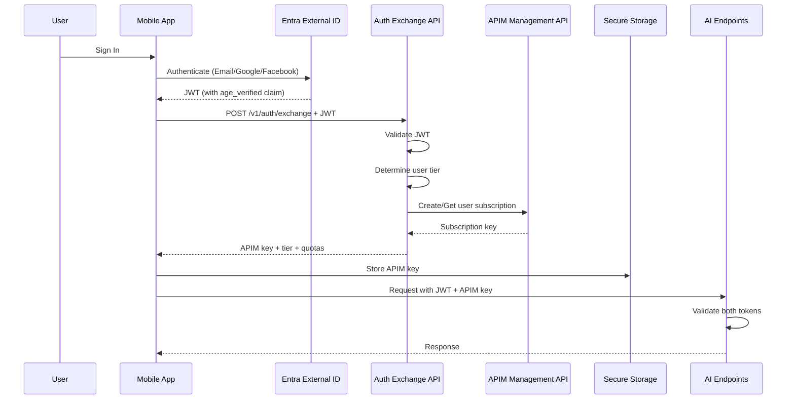

# Runtime Token Exchange Architecture

## Overview

MyBartenderAI has transitioned from build-time APIM key injection to a secure runtime token exchange system. This provides per-user, revocable API access with tier-based authorization.

## Architecture Components

### 1. Authentication Flow



### 2. Security Model

#### Dual Authentication Required
All AI endpoints require BOTH:
1. **JWT Token**: Proves user identity (from Entra External ID)
2. **APIM Subscription Key**: Proves tier/quota (from runtime exchange)

#### Key Security Features
- No hardcoded keys in source code or APK
- Per-user APIM subscriptions (pattern: `user-{userId}-{tier}`)
- Keys stored in secure device storage
- Automatic key rotation (monthly)
- Instant revocation capability
- Age verification enforced via JWT claims

### 3. Tier Management

| Tier | Monthly Tokens | Monthly Scans | AI Features | Price |
|------|---------------|---------------|-------------|--------|
| Free | 10,000 | 2 | ✅ Limited | $0 |
| Premium | 300,000 | 30 | ✅ Full | $4.99 |
| Pro | 1,000,000 | 100 | ✅ Full | $8.99 |

### 4. API Endpoints

#### `/v1/auth/exchange` (POST)
Exchange JWT for APIM subscription key

**Request:**
```http
POST /v1/auth/exchange
Authorization: Bearer <Entra_External_ID_JWT>
```

**Response:**
```json
{
  "subscriptionKey": "user-specific-apim-key",
  "tier": "premium",
  "productId": "premium-tier",
  "expiresIn": 86400,
  "expiresAt": "2024-11-15T12:00:00Z",
  "quotas": {
    "tokensPerMonth": 300000,
    "scansPerMonth": 30,
    "aiEnabled": true
  }
}
```

#### `/v1/auth/rotate` (POST)
Admin endpoint for manual key rotation

**Request:**
```http
POST /v1/auth/rotate
x-functions-key: <admin-function-key>
Content-Type: application/json

{
  "userId": "user-id-to-rotate",
  "reason": "suspected compromise"
}
```

### 5. Mobile App Integration

#### ApimSubscriptionService
Manages runtime APIM keys with automatic refresh:

```dart
class ApimSubscriptionService {
  // Exchange JWT for APIM key on login
  Future<void> exchangeTokenForSubscription();

  // Get current key (auto-refresh if needed)
  Future<String?> getSubscriptionKey();

  // Get headers for API calls (JWT + APIM)
  Future<Map<String, String>> getAuthHeaders();

  // Handle 401/403 with re-exchange
  Future<bool> handleAuthError();
}
```

#### Error Handling
Automatic retry with token re-exchange on:
- 401 Unauthorized → Re-authenticate and exchange
- 403 Forbidden → Check subscription tier
- 429 Rate Limited → Show upgrade prompt

### 6. APIM Configuration

#### Product Structure
```
APIM Service (apim-mba-001)
├── Products
│   ├── free-tier (no AI access)
│   ├── premium-tier (300K tokens/month)
│   └── pro-tier (1M tokens/month)
└── Subscriptions (per-user)
    ├── user-{userId1}-premium
    ├── user-{userId2}-pro
    └── user-{userId3}-free
```

#### Policy Requirements
AI endpoints enforce:
1. JWT validation (Entra External ID)
2. Age verification claim
3. APIM subscription key validation
4. Rate limiting per product tier
5. Quota enforcement

### 7. Key Rotation

#### Automatic Monthly Rotation
- Timer function runs on 1st of each month at 3 AM UTC
- Rotates all user subscriptions older than 7 days
- Clients handle rotation transparently via re-exchange

#### Manual Rotation
- Admin can trigger immediate rotation
- Used for suspected compromise
- Targeted per-user or bulk operation

### 8. Monitoring & Compliance

#### Logging
- No full keys logged (last 4 chars only)
- JWT validation failures logged
- Quota exhaustion tracked
- Rotation events recorded

#### Compliance Features
- GDPR: Per-user revocable access
- Age verification enforced
- No PII in APIM subscription names
- Audit trail for all operations

## Implementation Checklist

### Backend
- [x] `/v1/auth/exchange` function
- [x] `/v1/auth/rotate` function
- [x] Monthly rotation timer
- [x] APIM dual-auth policy
- [x] Product tier configuration
- [ ] Deploy functions to Azure
- [ ] Configure APIM products in portal

### Mobile App
- [x] ApimSubscriptionService
- [x] Remove build-time key injection
- [x] Secure storage integration
- [x] Auto-retry on 401/403
- [x] Tier-based feature gating
- [ ] Test token exchange flow
- [ ] Test key rotation handling

### Security Verification
- [ ] No hardcoded keys in code
- [ ] APK contains no APIM keys
- [ ] JWT validation working
- [ ] Age verification enforced
- [ ] Rate limiting active
- [ ] Rotation successful

## Migration from Build-Time Keys

### Old System (Deprecated)
```bash
# Build with hardcoded key
flutter build apk --dart-define=APIM_SUBSCRIPTION_KEY=<key>
```
- Single shared key for all users
- Key embedded in APK
- No revocation without app update
- No per-user tracking

### New System (Current)
```bash
# Build without keys
flutter build apk --release
```
- Per-user keys via runtime exchange
- Keys in secure device storage
- Instant revocation capability
- Full audit trail

## Troubleshooting

### Common Issues

1. **"AI features require Premium subscription"**
   - User is on Free tier
   - Solution: Upgrade subscription

2. **"Authentication failed. Please sign in again"**
   - JWT expired or invalid
   - Solution: Force re-authentication

3. **"Rate limit exceeded"**
   - Monthly quota exhausted
   - Solution: Upgrade tier or wait

4. **Key rotation causes 401**
   - Expected behavior
   - App automatically re-exchanges

### Debug Commands

```powershell
# Check user's APIM subscription
az apim subscription show \
  --resource-group rg-mba-prod \
  --service-name apim-mba-001 \
  --subscription-id "user-{userId}-{tier}"

# Manually rotate a user's key
curl -X POST https://func-mba-fresh.azurewebsites.net/api/v1/auth/rotate \
  -H "x-functions-key: <admin-key>" \
  -H "Content-Type: application/json" \
  -d '{"userId": "user-id", "reason": "testing"}'

# Test token exchange
curl -X POST https://apim-mba-001.azure-api.net/api/v1/auth/exchange \
  -H "Authorization: Bearer <jwt>"
```

## Security Best Practices

1. **Never log full keys** - Use masking helper
2. **Validate JWT signature** - Not just claims
3. **Check age_verified claim** - Legal requirement
4. **Monitor failed authentications** - Detect attacks
5. **Rotate keys regularly** - Monthly minimum
6. **Use secure storage** - Platform-specific encryption
7. **Handle 401/403 gracefully** - Auto-retry with re-exchange
8. **Implement rate limiting** - Prevent abuse
9. **Audit all operations** - Compliance requirement
10. **Test rotation flow** - Ensure seamless UX

---

*Last Updated: November 2024*
*Security Model: Runtime Token Exchange v1.0*