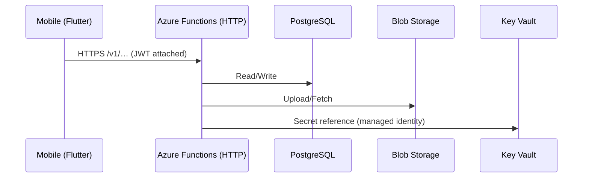
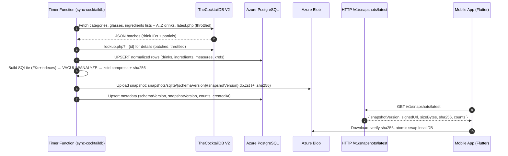

# Architecture — MyBartenderAI (MVP)

## System overview
- Flutter app (feature-first clean architecture; Riverpod state; GoRouter)
- Azure Functions (HTTP) expose HTTPS endpoints directly (no APIM gateway)
- Azure PostgreSQL for mirrored recipe corpus; SQLite on-device cache
- Azure Blob for user images; Key Vault for secrets; App Insights for telemetry
- Mobile → Azure Functions (HTTPS) → (PostgreSQL/Blob/Key Vault)

## Data flow (Mermaid)


## AI Model & Cost Strategy
- Models: use OpenAI GPT-4.1 family via backend-only calls (never from the device).
  - Default: gpt-4.1-mini for recommendations (cost/latency sweet spot).
  - Long-context or complex chains: gpt-4.1.
  - Future on-device experiments: gpt-4.1-nano when supported via vetted SDKs.

## Prompt Caching (OpenAI)
We enable OpenAI Prompt Caching for stable, repeated system/tool prompts. The Azure Function computes a cache key
from: model + promptTemplateVersion + normalized tools list + schema hash. Requests include cache hints and reuse keys
across users (no PII in keys). This yields substantial savings for identical prompts during traffic bursts. 
Telemetry logs only the cache-key hash, never raw prompts.

## Realtime (deferred)
- Voice guidance may be added later.
- If/when we add "hands-free bartender", use OpenAI Realtime API via the backend as a websocket proxy. The mobile app
  streams mic audio to Functions, which relays to OpenAI Realtime and streams transcripts/instructions back. Not part of MVP.

## Pricing guardrails
- Token caps enforced in app + server. Server rejects over-quota calls early. Prompt Caching reduces marginal cost for
  premium tiers; see PLAN for tests.

## Feature: CocktailDB Mirror & SQLite Snapshot Service

**Goal:** Pull premium TheCocktailDB data on a schedule into Azure Database for PostgreSQL (normalized), then publish a versioned, read-only SQLite snapshot to Azure Blob for the mobile app to download and cache locally. Optionally publish deltas for smaller updates.

### Components
- **Timer Function** `sync-cocktaildb` (nightly @ 03:30 UTC; manual HTTP trigger available for admins)
- **HTTP Function** `GET /v1/snapshots/latest` → returns snapshot metadata + signed URL
- **HTTP Function** `GET /v1/changes?since={version}` → NDJSON of upserts/deletes (optional for MVP)
- **PostgreSQL**: canonical schema (drinks, ingredients, measures, categories, glasses, tags)
- **Blob Storage**: `/snapshots/sqlite/{schemaVersion}/{snapshotVersion}.db.zst` (and `.sha256`)
- **Key Vault**: `COCKTAILDB-API-KEY` (premium), DB creds via MI + KV references
- **App**: On first run (or when `snapshotVersion` changes), download+decompress SQLite, hydrate local cache

### Sequence (Mermaid)
```mermaid
sequenceDiagram
  autonumber
  participant T as Timer Function (sync-cocktaildb)
  participant CDB as TheCocktailDB (premium)
  participant PG as Azure DB for PostgreSQL
  participant BL as Azure Blob Storage
  participant H as HTTP Function (/v1/snapshots/latest)
  participant M as Mobile App (Flutter)

  T->>CDB: Fetch drinks/ingredients/categories (paged, with ETags)
  CDB-->>T: 200 OK (JSON batches)
  T->>PG: Upsert normalized rows (COPY/UPSERT)
  T->>T: Build SQLite from PG (read-only; VACUUM; ANALYZE)
  T->>BL: Upload snapshot .db.zst + .sha256 (versioned)
  Note over T: Write metadata: {schemaVersion, snapshotVersion, counts, createdAt}
  M->>H: GET /v1/snapshots/latest
  H-->>M: { snapshotVersion, signedUrl, size, sha256 }
  M->>BL: Download snapshot
  M->>M: Verify sha256 → replace local DB atomically
```

- No PII persisted; only public catalog data.
- Secrets: `COCKTAILDB-API-KEY` and DB creds in Key Vault; app settings use `@Microsoft.KeyVault(SecretUri=...)`.
- Redaction: remove querystrings from logs; never log upstream response bodies; log only counts/hashes.
- Authorization:
  - `/v1/snapshots/latest`: anonymous OK (returns **signed URL** with short expiry).
  - `/v1/changes`: same as above (or gated later).
  - `/v1/admin/sync`: requires `x-functions-key` (function auth) or Entra claim `role=admin` if you enable Easy Auth later.
- Rate limiting upstream calls (respect TheCocktailDB ToS): page-size throttle, If-Modified-Since/ETag, 429 retry with backoff.

## Feature: CocktailDB V2 Mirror → SQLite Snapshots

**Goal:** Nightly import from TheCocktailDB (V2, Premium key in URL path) into Azure Database for PostgreSQL, build a read‑only SQLite snapshot, publish to Azure Blob, and serve a short‑lived SAS URL to the app for offline use.

**Source endpoints (examples):**
- Search/listing: `search.php?f=a..z`, `list.php?c=list|g=list|i=list|a=list`, `filter.php?i=<ingredient>|a=<alcoholic>|c=<category>|g=<glass>` (base semantics) :contentReference[oaicite:1]{index=1}
- Premium: `latest.php` (recent cocktails) and multi‑ingredient filters (Premium only). :contentReference[oaicite:2]{index=2}
- Image sizes: thumb/medium/large URLs provided by CocktailDB if needed. :contentReference[oaicite:3]{index=3}

**Pipeline**

- Treat the email/API key as a **secret**. Do **not** check it into Git, CI logs, or mobile app code.
- Store `COCKTAILDB-API-KEY` in **Azure Key Vault**; reference it in Function App settings via `@Microsoft.KeyVault(SecretUri=...)`.
- Server‑side only access to TheCocktailDB; the app never calls CocktailDB directly.
- Redaction: strip querystrings and headers from logs. Log counts and hashes only.
