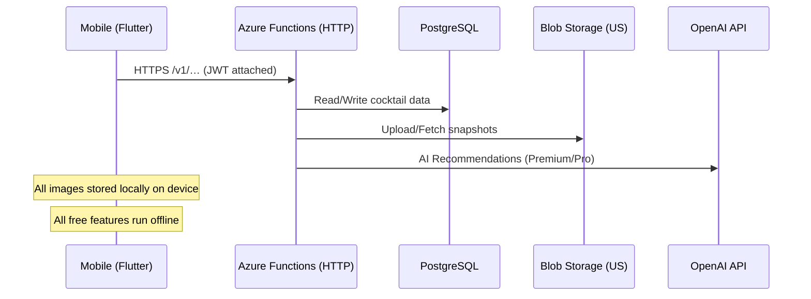
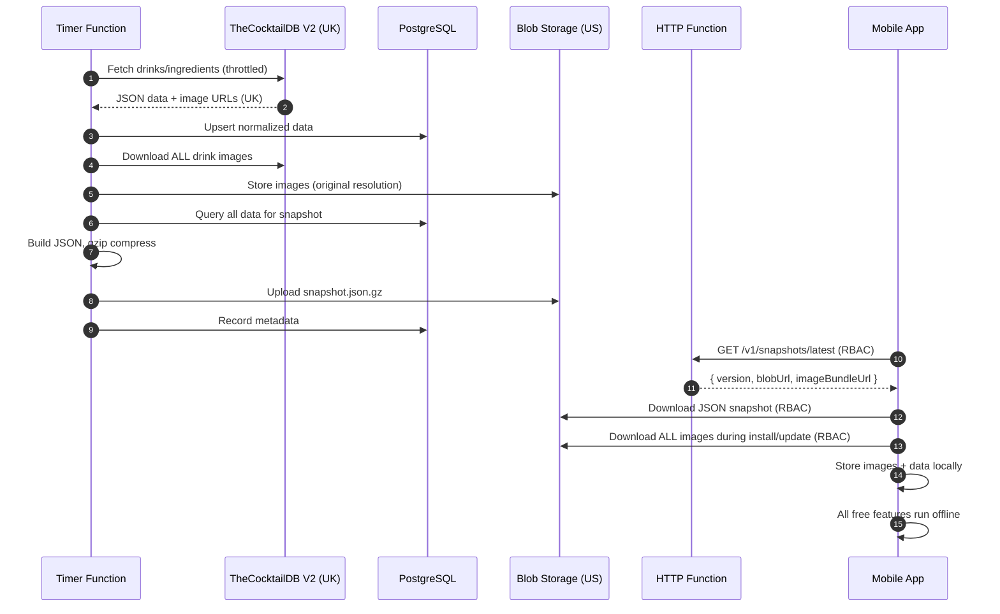

# Architecture — MyBartenderAI (MVP)

## System Overview
- Flutter app (feature-first clean architecture; Riverpod state; GoRouter)
- Azure Functions (HTTP) expose HTTPS endpoints directly (no APIM gateway)
- Azure PostgreSQL for authoritative recipe corpus with AI enhancements
- Azure Blob for cocktail images (US-hosted) and JSON snapshots
- Key Vault for secrets; App Insights for telemetry
- All free features run locally on device (offline-first)
- Mobile → Azure Functions (HTTPS) → (PostgreSQL/Blob/Key Vault/OpenAI)

## Core Features
### Current (MVP)
- AI-powered cocktail recommendations based on inventory
- Offline-first mobile experience with local SQLite
- JWT-based authentication and rate limiting

### Planned (Premium/Pro)
- **Vision AI**: Photograph home bar for automatic inventory
- **Voice Assistant**: Interactive cocktail-making guidance
- **Custom Recipes**: User-created cocktails with AI enhancement

## Data Flow (Mermaid)


## AI Model & Cost Strategy
- **Recommendations**: GPT-4.1-mini (cost/latency optimized)
- **Complex queries**: GPT-4.1 with prompt caching
- **Vision**: Azure Computer Vision (70% confidence threshold)
- **Voice**: OpenAI Whisper + TTS (future)
- **Prompt Caching**: Enabled for stable system prompts

## Tier Quotas (Monthly)
| Feature | Free | Premium | Pro |
|---------|------|---------|-----|
| AI Recommendations | 10 | 100 | Unlimited |
| Vision Scans | 0 | 5 | 50 |
| Voice Assistant | 0 | 30 min | 5 hours |
| Custom Recipes | 3 | 25 | Unlimited |
| Snapshot Downloads | Unlimited | Unlimited | Unlimited |

## Feature: CocktailDB Mirror & JSON Snapshot Service

**Goal:** Nightly sync from TheCocktailDB V2 API into PostgreSQL, download all images to Azure Blob Storage (US), build compressed JSON snapshots for mobile offline use.

### Architecture Changes (Post-MVP Review)
- **Removed**: better-sqlite3 dependency (Windows compatibility issues)
- **Replaced**: SQLite generation with JSON snapshots (pure JavaScript)
- **Compression**: gzip instead of zstd (built-in, no dependencies)
- **Images**: Downloaded from TheCocktailDB (UK) to Azure Blob Storage (US), then bundled for mobile app installation/updates
- **Access**: RBAC-based (Managed Identity) - no SAS tokens

### Components
- **Timer Function** `sync-cocktaildb` (nightly @ 03:30 UTC)
- **HTTP Function** `GET /v1/snapshots/latest` → metadata with RBAC-secured access
- **HTTP Function** `GET /v1/images/manifest` → image bundle manifest for mobile sync
- **PostgreSQL**: Authoritative data with AI enhancements
- **Blob Storage**: 
  - `/snapshots/json/{schemaVersion}/{snapshotVersion}.json.gz`
  - `/drink-images/drinks/{filename}.jpg` (original resolution from TheCocktailDB)
- **Mobile**: Downloads JSON + all images during installation, stores locally for offline use

### Data Pipeline


### Snapshot Retention
- Keep last 7 daily snapshots (1 week rollback)
- Metadata tracks version, size, drink count
- Mobile app caches and checks for updates

## Security & Privacy

### Authentication & Access
- JWT authentication for API endpoints
- Azure Managed Identity (RBAC) for all service-to-service access
- RBAC-based blob access (no SAS tokens)
- Function keys for admin endpoints

### PII Policy
- **Custom recipe names**: Stripped from telemetry
- **Voice transcripts**: Opt-in storage only
- **Bar photos**: Processed ephemerally, never stored
- **User ingredients**: Hashed before logging
- **Anonymization**: 90-day retention for opted-in data

### Secrets Management
- **Key Vault**: `kv-mybartenderai-prod`
  - Secret `COCKTAILDB-API-KEY`: TheCocktailDB V2 API key
  - Secret `OpenAI`: OpenAI API key (vault name is "OpenAI")
  - Secret `POSTGRES-CONNECTION-STRING`: PostgreSQL connection string
- **Function App**: Uses `func-cocktaildb2-uami` Managed Identity with Key Vault Secrets User role
- **App Settings**: Use `@Microsoft.KeyVault(VaultName=kv-mybartenderai-prod;SecretName=...)`
- **Blob Storage**: RBAC access via Managed Identity (Storage Blob Data Contributor)

## Mobile App Updates

### JSON Import Strategy
1. Download compressed JSON snapshot
2. Decompress in memory
3. Parse JSON structure
4. Import to local SQLite using transactions
5. Atomic database swap

### Image Storage Strategy
- **Initial Install**: Download ALL drink images (~621 images) from Azure Blob to device
- **Updates**: Download only new/changed images (delta sync via manifest)
- **Source**: TheCocktailDB images re-hosted in Azure Blob Storage (US region)
- **Local Storage**: All images stored on device for instant offline access
- **No Network**: Free features (browse, search, view recipes) work 100% offline
- **Premium Features Only**: AI recommendations, vision, voice require network

## Future Enhancements

### Phase 2: Premium Features
- Vision AI integration for inventory scanning
- Voice-guided cocktail making
- Custom recipe creation with AI assistance

### Phase 3: Advanced
- Real-time collaboration on recipes
- Social features (share custom cocktails)
- Ingredient substitution AI
- Cocktail history and preferences learning

## Development & Deployment

### Local Development
```bash
# Backend
cd apps/backend
npm install  # Windows-compatible, no native modules
npm run build
func start

# Mobile
cd mobile/app
flutter pub get
flutter run
```

### Deployment
- **Azure Functions**: ZIP deployment to Linux Flex Consumption plan (`func-cocktaildb2`)
- **SDK**: Azure Functions v4 programming model
- **Runtime**: Node.js 20 on Linux
- **No native dependencies**: Pure JavaScript/TypeScript (no better-sqlite3)
- **CI/CD**: GitHub Actions workflow (`.github/workflows/main_func-cocktaildb2.yml`)
- **Secrets**: All environment variables via Key Vault references
- **Access**: Managed Identity (`func-cocktaildb2-uami`) with RBAC

## Cost Optimization
- **Current**: ~$50-100/month (PostgreSQL dominant)
- **Optimized**: ~$2-5/month
  - Functions: Flex Consumption plan (~$0.20/million executions, essentially free for MVP)
  - Storage: ~$0.50-1/month (snapshots + ~621 images)
  - PostgreSQL: Basic tier ~$30/month (smallest tier)
  - Blob egress: Minimal (one-time image downloads per user)
  - No CDN costs (eliminated Front Door)
- **Premium tier revenue**: Covers AI API costs (OpenAI)
