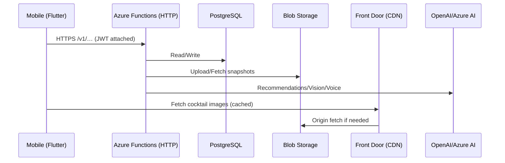
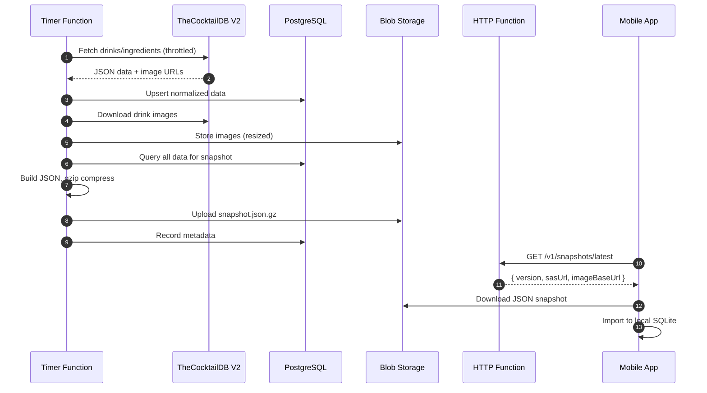

# Architecture — MyBartenderAI (MVP)

## System Overview
- Flutter app (feature-first clean architecture; Riverpod state; GoRouter)
- Azure Functions (HTTP) expose HTTPS endpoints directly (no APIM gateway)
- Azure PostgreSQL for authoritative recipe corpus with AI enhancements
- Azure Blob for cocktail images and JSON snapshots
- Azure Front Door for US-based CDN delivery
- Key Vault for secrets; App Insights for telemetry
- Mobile → Azure Functions (HTTPS) → (PostgreSQL/Blob/Key Vault/OpenAI)

## Core Features
### Current (MVP)
- AI-powered cocktail recommendations based on inventory
- Offline-first mobile experience with local SQLite
- JWT-based authentication and rate limiting

### Planned (Premium/Pro)
- **Vision AI**: Photograph home bar for automatic inventory
- **Voice Assistant**: Interactive cocktail-making guidance
- **Custom Recipes**: User-created cocktails with AI enhancement

## Data Flow (Mermaid)


## AI Model & Cost Strategy
- **Recommendations**: GPT-4.1-mini (cost/latency optimized)
- **Complex queries**: GPT-4.1 with prompt caching
- **Vision**: Azure Computer Vision (70% confidence threshold)
- **Voice**: OpenAI Whisper + TTS (future)
- **Prompt Caching**: Enabled for stable system prompts

## Tier Quotas (Monthly)
| Feature | Free | Premium | Pro |
|---------|------|---------|-----|
| AI Recommendations | 10 | 100 | Unlimited |
| Vision Scans | 0 | 5 | 50 |
| Voice Assistant | 0 | 30 min | 5 hours |
| Custom Recipes | 3 | 25 | Unlimited |
| Snapshot Downloads | Unlimited | Unlimited | Unlimited |

## Feature: CocktailDB Mirror & JSON Snapshot Service

**Goal:** Nightly sync from TheCocktailDB V2 API into PostgreSQL, download images to Blob Storage, build compressed JSON snapshots for mobile offline use.

### Architecture Changes (Post-MVP Review)
- **Removed**: better-sqlite3 dependency (Windows compatibility issues)
- **Replaced**: SQLite generation with JSON snapshots (pure JavaScript)
- **Compression**: gzip instead of zstd (built-in, no dependencies)
- **Images**: Re-hosted in Azure Blob + Front Door (US-based delivery)

### Components
- **Timer Function** `sync-cocktaildb` (nightly @ 03:30 UTC)
- **HTTP Function** `GET /v1/snapshots/latest` → metadata + SAS URL
- **PostgreSQL**: Authoritative data with AI enhancements
- **Blob Storage**: 
  - `/snapshots/json/{schemaVersion}/{snapshotVersion}.json.gz`
  - `/images/cocktails/{drinkId}.jpg` (multiple sizes)
- **Front Door**: CDN for image delivery
- **Mobile**: Downloads JSON, imports to local SQLite

### Data Pipeline


### Snapshot Retention
- Keep last 7 daily snapshots (1 week rollback)
- Metadata tracks version, size, drink count
- Mobile app caches and checks for updates

## Security & Privacy

### Authentication & Access
- JWT authentication for API endpoints
- Azure Managed Identity for service-to-service
- SAS tokens for time-limited blob access
- Function keys for admin endpoints

### PII Policy
- **Custom recipe names**: Stripped from telemetry
- **Voice transcripts**: Opt-in storage only
- **Bar photos**: Processed ephemerally, never stored
- **User ingredients**: Hashed before logging
- **Anonymization**: 90-day retention for opted-in data

### Secrets Management
- `COCKTAILDB-API-KEY` in Key Vault
- `OPENAI_API_KEY` in Key Vault
- PostgreSQL connection via Managed Identity
- App settings use `@Microsoft.KeyVault(SecretUri=...)`

## Mobile App Updates

### JSON Import Strategy
1. Download compressed JSON snapshot
2. Decompress in memory
3. Parse JSON structure
4. Import to local SQLite using transactions
5. Atomic database swap

### Image Caching
- Images served from Front Door (US edge locations)
- Progressive loading with placeholders
- Local cache with LRU eviction
- Offline support for viewed cocktails

## Future Enhancements

### Phase 2: Premium Features
- Vision AI integration for inventory scanning
- Voice-guided cocktail making
- Custom recipe creation with AI assistance

### Phase 3: Advanced
- Real-time collaboration on recipes
- Social features (share custom cocktails)
- Ingredient substitution AI
- Cocktail history and preferences learning

## Development & Deployment

### Local Development
```bash
# Backend
cd apps/backend
npm install  # Windows-compatible, no native modules
npm run build
func start

# Mobile
cd mobile/app
flutter pub get
flutter run
```

### Deployment
- Azure Functions: ZIP deployment to Windows Consumption plan
- No native dependencies (pure JavaScript/TypeScript)
- Automated via GitHub Actions (future)
- Environment-specific settings in Key Vault

## Cost Optimization
- **Current**: ~$50-100/month (PostgreSQL dominant)
- **Optimized**: ~$2-5/month
  - Functions: Consumption plan (essentially free)
  - Storage: ~$1/month (snapshots + images)
  - PostgreSQL: Smallest tier sufficient
  - Front Door: Pay per GB (minimal)
- **Premium tier revenue**: Covers AI API costs
