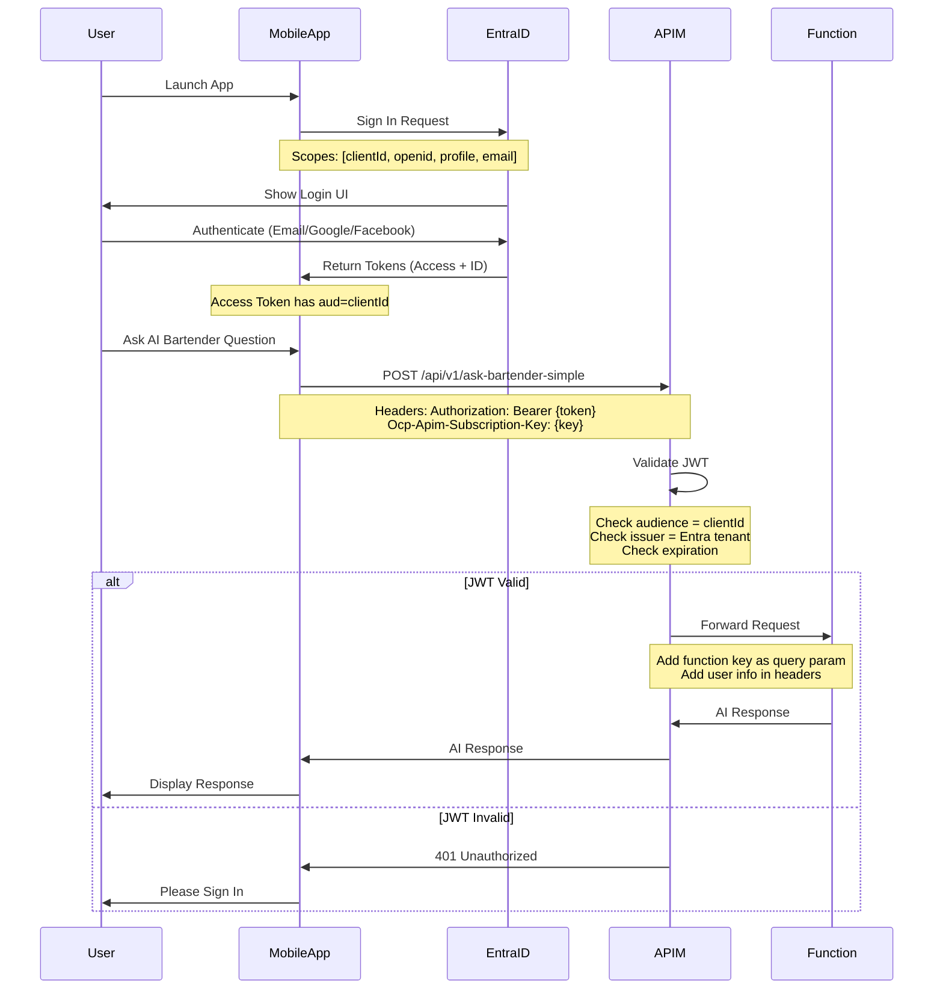

# Entra External ID Authentication Flow Documentation

## Overview

This document describes the complete authentication flow for MyBartenderAI using Microsoft Entra External ID (formerly Azure AD B2C) with Azure API Management as the secure gateway.

## Key Components

### 1. Entra External ID (CIAM)

- **Tenant**: mybartenderai.onmicrosoft.com
- **Tenant ID**: a82813af-1054-4e2d-a8ec-c6b9c2908c91
- **Client ID**: f9f7f159-b847-4211-98c9-18e5b8193045
- **User Flow**: mba-signin-signup
- **Supported Providers**: Email, Google, Facebook

### 2. Azure API Management (APIM)

- **Instance**: apim-mba-001
- **Gateway URL**: https://apim-mba-001.azure-api.net
- **Tier**: Developer (production will use Consumption tier)
- **Purpose**: Secure gateway, rate limiting, API key management, JWT validation

### 3. Azure Functions Backend

- **Function App**: func-mba-fresh (Premium EP1 plan)
- **Runtime**: Node.js v22 LTS
- **Key Endpoints**: ask-bartender-simple, recommend, snapshots-latest

## Authentication Flow



## Critical Configuration Details

### Mobile App (Flutter)

#### auth_service.dart

```dart
// Try to acquire token silently with OIDC scopes only
      final AuthenticationResult? result = await _msalAuth!.acquireTokenSilent(
        scopes: [
          'openid',
          'profile',
          'email',
        ],
      );


```

#### ask_bartender_service.dart

```dart
import 'dart:convert';
import 'package:dio/dio.dart';

import 'token_storage_service.dart';

/// Service for interacting with the AI Bartender API
class AskBartenderService {
  final Dio _dio;
  final TokenStorageService _tokenStorage;

  // Temporarily use direct function URL to bypass authentication issues
  // TODO: Move back to APIM once authentication is properly configured
  static const String _baseUrl = 'https://func-mba-fresh.azurewebsites.net';

  AskBartenderService({
    required TokenStorageService tokenStorage,
  }) : _tokenStorage = tokenStorage,
       _dio = Dio(BaseOptions(
    baseUrl: _baseUrl,
    connectTimeout: const Duration(seconds: 30),
    receiveTimeout: const Duration(seconds: 30),
    headers: {
      'Content-Type': 'application/json',
    },
  ));

  /// Send a message to the AI Bartender and get a response
  Future<String> askBartender({
    required String message,
    String? context,
  }) async {
    try {
      print('Sending message to AI Bartender: $message');
      if (context != null) {
        print('Context: $context');
      }

      // Temporarily bypass authentication to get AI chat working
      // TODO: Re-enable authentication once Entra External ID is properly configured
      final response = await _dio.post(
        '/api/v1/ask-bartender-simple?code=<REDACTED-FUNCTION-KEY>',
        data: {
          'message': message,
          'context': context ?? '',
        },
        // Not sending Authorization header for now
      );

      if (response.statusCode == 200) {
        final data = response.data;
        // Handle different response formats
        if (data is Map) {
          return data['response'] ?? data['message'] ?? 'I received your message but couldn\'t generate a proper response.';
        } else if (data is String) {
          try {
            final parsed = json.decode(data);
            if (parsed is Map) {
              return parsed['response'] ?? parsed['message'] ?? data;
            }
          } catch (_) {
            // If it's not JSON, return the string as is
            return data;
          }
        }
        return 'I received your message but couldn\'t generate a proper response.';
      } else {
        throw Exception('Failed to get response: ${response.statusCode}');
      }
    } on DioException catch (e) {
      print('DioException calling ask-bartender: ${e.message}');
      if (e.response != null) {
        print('Response data: ${e.response?.data}');
        print('Response status: ${e.response?.statusCode}');
      }

      // Check if it's a timeout
      if (e.type == DioExceptionType.connectionTimeout ||
          e.type == DioExceptionType.receiveTimeout) {
        throw Exception('The AI Bartender is taking too long to respond. Please try again.');
      }

      // Check for network issues
      if (e.type == DioExceptionType.connectionError) {
        throw Exception('Cannot connect to the AI Bartender. Please check your internet connection.');
      }

      throw Exception('Failed to communicate with the AI Bartender: ${e.message}');
    } catch (e) {
      print('Error calling ask-bartender: $e');
      throw Exception('An unexpected error occurred: $e');
    }
  }
}
```

### APIM Configuration

#### API-Level Policy (api-policy.xml)

```xml
<!--
  JWT Validation Policy for Microsoft Entra External ID
  Apply this policy to API operations requiring user authentication

  Tenant: mybartenderai.onmicrosoft.com
  Tenant ID: a82813af-1054-4e2d-a8ec-c6b9c2908c91
  Client ID: f9f7f159-b847-4211-98c9-18e5b8193045
  User Flow: mba-signin-signup
-->
<policies>
	<inbound>
		<base />
		<!-- Validate JWT token from Entra External ID -->
		<validate-jwt header-name="Authorization" failed-validation-httpcode="401" failed-validation-error-message="Unauthorized. Valid JWT token required." require-expiration-time="true" require-scheme="Bearer" require-signed-tokens="true">
			<!-- OpenID Connect discovery URL for Entra External ID -->
			<openid-config url="https://mybartenderai.ciamlogin.com/mybartenderai.onmicrosoft.com/v2.0/.well-known/openid-configuration" />
			<!-- Validate audience (MyBartenderAI Mobile app client ID) -->
			<audiences>
				<audience>f9f7f159-b847-4211-98c9-18e5b8193045</audience>
			</audiences>
			<!-- Validate issuer (Entra External ID tenant) -->
			<issuers>
				<issuer>https://a82813af-1054-4e2d-a8ec-c6b9c2908c91.ciamlogin.com/a82813af-1054-4e2d-a8ec-c6b9c2908c91/v2.0</issuer>
			</issuers>
			<!-- Required claims -->
			<required-claims>
				<claim name="aud" match="any">
					<value>f9f7f159-b847-4211-98c9-18e5b8193045</value>
				</claim>
			</required-claims>
		</validate-jwt>
		<!-- Extract user ID from JWT and add to header for backend -->
		<set-header name="X-User-Id" exists-action="override">
			<value>@{
                Jwt jwt;
                if (context.Request.Headers.GetValueOrDefault("Authorization","").Replace("Bearer ", "").TryParseJwt(out jwt))
                {
                    return jwt?.Subject ?? "";
                }
                return "";
            }</value>
		</set-header>
		<!-- Extract user email if available -->
		<set-header name="X-User-Email" exists-action="override">
			<value>@{
                Jwt jwt;
                if (context.Request.Headers.GetValueOrDefault("Authorization","").Replace("Bearer ", "").TryParseJwt(out jwt))
                {
                    return jwt?.Claims.GetValueOrDefault("email", "") ?? jwt?.Claims.GetValueOrDefault("preferred_username", "") ?? "";
                }
                return "";
            }</value>
		</set-header>
		<!-- Extract user name if available -->
		<set-header name="X-User-Name" exists-action="override">
			<value>@{
                Jwt jwt;
                if (context.Request.Headers.GetValueOrDefault("Authorization","").Replace("Bearer ", "").TryParseJwt(out jwt))
                {
                    return jwt?.Claims.GetValueOrDefault("name", "") ?? "";
                }
                return "";
            }</value>
		</set-header>
	</inbound>
	<backend>
		<base />
	</backend>
	<outbound>
		<base />
	</outbound>
	<on-error>
		<base />
		<!-- Return proper 401 for JWT authentication failures -->
		<choose>
			<when condition="@(context.LastError.Source == &amp;quot;validate-jwt&amp;quot;)">
				<return-response>
					<set-status code="401" reason="Unauthorized" />
					<set-header name="WWW-Authenticate" exists-action="override">
						<value>Bearer realm="MyBartenderAI"</value>
					</set-header>
					<set-header name="Content-Type" exists-action="override">
						<value>application/json</value>
					</set-header>
					<set-body>@{
                        return new JObject(
                            new JProperty("code", "UNAUTHORIZED"),
                            new JProperty("message", "Valid authentication token required. Please sign in."),
                            new JProperty("traceId", context.RequestId)
                        ).ToString();
                    }</set-body>
				</return-response>
			</when>
		</choose>
	</on-error>
</policies>
```

#### Operation-Level Policy (apim-operation-policy.xml)

```xml
<!-- Add function key for backend authentication -->
<set-query-parameter name="code" exists-action="override">
  <value>{{function-key}}</value>
</set-query-parameter>
```

## Backend Consumption of APIM Headers

### User Profile Population (January 2026)

The APIM policy (shown above) extracts three headers from the JWT and forwards them to backend functions:

| Header | JWT Claim | Purpose |
| --- | --- | --- |
| `X-User-Id` | `sub` | Azure AD subject (user identifier) |
| `X-User-Email` | `email` or `preferred_username` | User's email address |
| `X-User-Name` | `name` | User's display name |

Backend functions read these headers and pass them to `getOrCreateUser()` in `services/userService.js`, which:

1. **New users**: Stores `email` and `display_name` in the `users` table at creation time
2. **Existing users**: Refreshes `email` and `display_name` on every login using `COALESCE()` (new value if provided, otherwise keep existing)

This means existing users are automatically backfilled — no SQL migration needed. The next API call after deployment populates their profile data.

### Endpoints That Populate User Profile

| Endpoint | File | Header Access Pattern |
| --- | --- | --- |
| `ask-bartender-simple` | `ask-bartender-simple/index.js` | `req.headers['x-user-email']` |
| `vision-analyze` | `vision-analyze/index.js` | `req.headers['x-user-email']` |
| `voice-bartender` | `voice-bartender/index.js` | `req.headers['x-user-email']` |
| `voice-session` | `index.js` | `request.headers.get('x-user-email')` |

**Note**: The standalone function files (v3 programming model) use `req.headers['x-user-email']` syntax, while `index.js` (v4 programming model) uses `request.headers.get('x-user-email')`.

### SQL Behavior

```sql
-- On existing user login, the UPDATE uses COALESCE to prevent overwriting with NULL:
UPDATE users
SET last_login_at = NOW(), updated_at = NOW(),
    email = COALESCE($2, email),          -- keep existing if header missing
    display_name = COALESCE($3, display_name)  -- keep existing if header missing
WHERE id = $1
RETURNING id, azure_ad_sub, tier, email, display_name, created_at, last_login_at;

-- On new user creation, email and display_name are included in the INSERT:
INSERT INTO users (azure_ad_sub, tier, email, display_name, created_at, updated_at, last_login_at)
VALUES ($1, 'pro', $2, $3, NOW(), NOW(), NOW())
RETURNING id, azure_ad_sub, tier, email, display_name, created_at, last_login_at;
```

### Verification

After deployment, verify with:

```sql
-- Check that active users have email/display_name populated:
SELECT id, email, display_name, tier, last_login_at
FROM users
ORDER BY last_login_at DESC
LIMIT 10;
```

---

## Common Issues and Solutions

### Issue 1: 401 Unauthorized from APIM

**Cause**: Token has wrong audience (e.g., Microsoft Graph instead of client ID)
**Solution**: Request client ID as scope, not Graph scopes

### Issue 2: Function Key in Mobile App

**Cause**: Direct function calls bypass APIM security
**Solution**: Always use APIM gateway URL, never embed function keys in app

### Issue 3: Azure AD B2C vs Entra External ID Confusion

**Cause**: Documentation mixing deprecated B2C patterns with new Entra External ID
**Solution**: Use Entra External ID patterns (client ID as scope for external tenants)

## Security Best Practices

1. **No Function Keys in Mobile Apps**: Function keys stored in APIM named values only
2. **JWT Validation at Gateway**: APIM validates all tokens before forwarding
3. **Managed Identity**: Function App uses MI for Key Vault access
4. **Minimal PII Collection**: Only essential user information stored
5. **Token Refresh**: Mobile app handles token refresh automatically

## Testing

### PowerShell Test Script

```powershell
# Test without auth (should fail with 401)
$headers = @{
    'Content-Type' = 'application/json'
    'Ocp-Apim-Subscription-Key' = 'a4f267a3dd1b4cdba4e9cb4d29e565c0'
}

$response = Invoke-RestMethod -Uri 'https://apim-mba-001.azure-api.net/api/v1/ask-bartender-simple' `
    -Method Post -Headers $headers -Body '{"message":"test"}'
# Expected: 401 Unauthorized
```

## Current Status

✅ **Completed**:

- Entra External ID tenant configured
- APIM JWT validation policy implemented
- Mobile app using correct token scopes
- Function key securely stored in APIM
- Authentication flow fully functional
- Backend functions populate user email and display_name from APIM-forwarded JWT claims (January 2026)

## APK Build Location

Latest APK with Entra External ID authentication:

```
C:\backup dev02\mybartenderAI-MVP\MyBartenderAI-TodaysSpecial-nov10.apk
```

## Next Steps

1. Test APK on Android device
2. Verify sign-in with Email/Google/Facebook
3. Confirm AI Bartender chat works with authentication
4. Monitor APIM analytics for usage patterns
5. Plan migration to APIM Consumption tier for production

---

*Last Updated: January 29, 2026*
*Authentication Method: Entra External ID (NOT Azure AD B2C)*
