# FEATURE — Friends via Code (Aliases, Push & Invite Links)

> **Audience:** Claude Code, Codex, senior devs  
> **Stack:** Flutter (Riverpod, Firebase Messaging), Azure (API Management, Azure Functions Node.js, PostgreSQL, Notification Hubs, Blob Static Website, Key Vault), Azure OpenAI GPT‑4o‑mini (optional), Microsoft Entra External ID (CIAM)

This spec defines **two** tightly scoped social flows:

1. **Internal share (alias + push)**  
   
   - User A (has app) shares a recipe directly to User B (also has app).  
   - B is identified by a **pseudonymous alias** (e.g. `@bitter-owl-592`) and receives a **push notification** and an **Inbox** entry.  
   - No PII (name/email/phone) persists; aliases are synthetic.

2. **External share (invite link + static web preview)**  
   
   - User A shares a recipe to **anyone** via a URL (invite token).  
   - Recipient C (no app) opens a **static HTML page** from Blob (`https://share.mybartenderai.com/i/{token}`) with the recipe preview.  
   - If C later installs the app, the same link can be “claimed” so the recipe appears in C’s Inbox.

Identity is always via **Entra External ID** (`sub` claim) — that’s our only durable user key.

---

## 0. Core invariants

- **No PII at rest**: no names, emails, phones, addresses. We only store:
  - `user_id` (CIAM `sub`)
  - `alias` (synthetic handle, e.g. `@bitter-owl-592`)
  - `recipe_id`, invite tokens, timestamps, and user‑entered messages/taglines.
- **Routing**:
  - Internal: `alias` → `user_id` via `user_profile` → Notification Hubs tag `u:{user_id}`.
  - External: invite `token` → `share_invite` row → web preview and (optional) in‑app claim.

---

## 1. High‑level architecture

```mermaid
flowchart LR
    subgraph Mobile App (Flutter)
      A[My AI Bartender App]<-->FM(Firebase Messaging SDK)
    end

    subgraph Azure
      APIM[API Management<br/>(apim-mba-001)]
      FN[Azure Functions (Node.js)<br/>func-mba-fresh]
      DB[(PostgreSQL)]
      BLOB[Blob Static Website<br/>share.mybartender.ai]
      NH[(Notification Hubs)]
      KV{{Key Vault}}
      AOAI[(Azure OpenAI<br/>GPT‑4o‑mini)]
    end

    subgraph Push Networks
      APNs[[Apple APNs]]
      FCM[[Google FCM v1]]
    end

    A -->|Bearer JWT (CIAM)| APIM
    APIM -->|validate-jwt + rate/quotas + CORS| FN
    FN -->|read/write| DB
    FN -->|upload static invite page| BLOB
    FN -->|send push| NH
    KV -->|secrets| FN
    FN -->|optional tagline| AOAI
    NH -->|deliver| FCM
    NH -->|deliver| APNs
    FCM -->|push notification| A
    APNs -->|push notification| A
    BLOB -->|static HTML recipe preview| Browser
```

**JWT source**: Microsoft Entra External ID (CIAM).  

- Issuer: `https://{tenant}.ciamlogin.com/{tenantId}/v2.0`  
- Audience: API app registration (`api://my-ai-bartender-api` or similar)  
- Durable user id: `sub`

---

## 2. Internal share (alias + push) — A → B (both have app)

### 2.1 Data model for internal share

**user_profile**

```sql
CREATE TABLE IF NOT EXISTS user_profile (
  user_id       TEXT PRIMARY KEY,              -- CIAM sub
  alias         TEXT UNIQUE NOT NULL,          -- synthetic handle, e.g. '@bitter-owl-592'
  display_name  TEXT CHECK (char_length(display_name) <= 30), -- optional user-chosen display name
  share_code    TEXT UNIQUE,                   -- optional legacy / backup code
  created_at    TIMESTAMPTZ NOT NULL DEFAULT now(),
  last_seen     TIMESTAMPTZ
);
CREATE UNIQUE INDEX IF NOT EXISTS uq_user_profile_alias ON user_profile(alias);
```

> **Alias generation**: Server generates friendly aliases from a word list (e.g. adjective-animal-###) and enforces uniqueness. **System-generated only** - no user-chosen aliases to avoid PII concerns. Users may optionally add a 30-character display name shown alongside their alias (e.g., "John's Bar (@bitter-owl-592)"), but sharing is always done via the unique alias identifier.

**recipe_share**

```sql
CREATE TABLE IF NOT EXISTS recipe_share (
  id            BIGSERIAL PRIMARY KEY,
  from_user_id  TEXT NOT NULL REFERENCES user_profile(user_id) ON DELETE CASCADE,
  to_user_id    TEXT NOT NULL REFERENCES user_profile(user_id) ON DELETE CASCADE,
  recipe_id     TEXT NOT NULL,
  message       TEXT CHECK (char_length(message) <= 200),
  tagline       TEXT,
  created_at    TIMESTAMPTZ NOT NULL DEFAULT now(),
  viewed_at     TIMESTAMPTZ
);
CREATE INDEX IF NOT EXISTS idx_share_to_created   ON recipe_share (to_user_id, created_at DESC);
CREATE INDEX IF NOT EXISTS idx_share_from_created ON recipe_share (from_user_id, created_at DESC);
```

**Notification Hubs Installations tags**

- Each device installation is tagged with **`u:{user_id}`**.  
- All notifications for user B (sub=`abc123…`) target tag `u:abc123…`.

---

### 2.2 Flow: A shares a recipe to B using B’s alias

#### Sequence

```mermaid
sequenceDiagram
  actor A as User A (sender)
  actor B as User B (recipient)
  participant APP as Flutter App
  participant APIM as API Mgmt
  participant API as Fn: share-recipe
  participant DB as PostgreSQL
  participant NH as Notification Hubs

  B->>APP: Views Profile (see alias @bitter-owl-592)
  B->>A: Shares alias (voice/text/QR)

  A->>APP: Choose recipe + enter @bitter-owl-592
  APP->>APIM: POST /v1/social/share-internal {alias, recipeId, message}
  APIM->>APIM: validate-jwt (CIAM) + per-user rate limit (by sub)
  APIM->>API: Forward request with X-User-Id = sub(A)
  API->>DB: SELECT user_id FROM user_profile WHERE alias = '@bitter-owl-592'
  alt not found
    API-->>APIM: 404
    APIM-->>APP: 404 (alias not found)
  else found
    API->>DB: INSERT recipe_share(from_user_id=A, to_user_id=B, ...)
    API->>NH: Send push to tag "u:{B.user_id}" (FCM/APNs payload)
    NH-->>B: Notification delivered on B's devices
    API-->>APIM: 201
    APIM-->>APP: 201
  end

  B->>APP: Tap notification
  APP->>APIM: GET /v1/social/inbox
  APIM->>API: Forward
  API->>DB: SELECT shares WHERE to_user_id=B
  API-->>APIM: 200 { items[...] }
  APIM-->>APP: 200
  B->>APP: Sees recipe “from @bitter-owl-592”
```



### 2.3 API design for internal share

**Security scheme**

```yaml
components:
  securitySchemes:
    bearerAuth:
      type: http
      scheme: bearer
      bearerFormat: JWT
```

**Get own user profile**

```yaml
/v1/users/me:
  get:
    security: [{ bearerAuth: [] }]
    summary: Get current user profile
    responses:
      "200":
        description: OK
        content:
          application/json:
            schema:
              type: object
              properties:
                userId: { type: string }
                alias: { type: string }
                shareCode: { type: string, nullable: true }
                createdAt: { type: string, format: date-time }
```

- If row doesn’t exist, Functions create `user_profile` with:
  - `user_id = sub`
  - `alias = generated unique pseudonym`
  - optional `share_code` for backup.

**Rotate alias (optional)**

```yaml
/v1/users/me/alias/rotate:
  post:
    security: [{ bearerAuth: [] }]
    summary: Rotate to a new system-generated alias
    responses:
      "200":
        content:
          application/json:
            schema:
              type: object
              properties:
                alias: { type: string }
```

- Generates a new alias from curated set; ensures uniqueness in DB.

**Share by alias**

```yaml
/v1/social/share-internal:
  post:
    security: [{ bearerAuth: [] }]
    summary: Share a recipe with another app user by alias
    requestBody:
      required: true
      content:
        application/json:
          schema:
            type: object
            required: [ alias, recipeId ]
            properties:
              alias:
                type: string
                description: "Recipient alias, e.g. @bitter-owl-592"
              recipeId:
                type: string
                description: "ID for standard cocktail (mutually exclusive with customRecipeId)"
              customRecipeId:
                type: string
                format: uuid
                description: "ID for Create Studio recipe (mutually exclusive with recipeId)"
              recipeType:
                type: string
                enum: [standard, custom]
                description: "Type of recipe being shared"
              message:
                type: string
                maxLength: 200
    responses:
      "201": { description: "Shared" }
      "400": { $ref: "#/components/schemas/Error" }
      "404": { $ref: "#/components/schemas/Error" }
      "429": { $ref: "#/components/schemas/Error" }
```

**Inbox / Outbox**

```yaml
/v1/social/inbox:
  get:
    security: [{ bearerAuth: [] }]
    summary: List recipes shared with the caller
    responses:
      "200":
        content:
          application/json:
            schema:
              type: object
              properties:
                items:
                  type: array
                  items:
                    type: object
                    properties:
                      id: { type: string }
                      senderAlias: { type: string }
                      recipeId: { type: string }
                      recipeName: { type: string }
                      tagline: { type: string, nullable: true }
                      message: { type: string, nullable: true }
                      createdAt: { type: string, format: date-time }
                      viewedAt: { type: string, format: date-time, nullable: true }

/v1/social/outbox:
  get:
    security: [{ bearerAuth: [] }]
    summary: List recipes the caller has shared
    responses:
      "200":
        content:
          application/json:
            schema:
              type: object
              properties:
                items:
                  type: array
                  items:
                    type: object
                    properties:
                      id: { type: string }
                      recipientAlias: { type: string, nullable: true }
                      type: { type: string, enum: [internal, invite] }
                      recipeId: { type: string }
                      recipeName: { type: string }
                      token: { type: string, nullable: true }   # invite token if type=invite
                      url: { type: string, format: uri, nullable: true }
                      message: { type: string, nullable: true }
                      tagline: { type: string, nullable: true }
                      createdAt: { type: string, format: date-time }
```

---

## 2.5 Create Studio Recipe Support

### Custom Recipe Storage

**custom_recipes**

```sql
CREATE TABLE IF NOT EXISTS custom_recipes (
  id            UUID PRIMARY KEY DEFAULT gen_random_uuid(),
  user_id       TEXT NOT NULL REFERENCES user_profile(user_id) ON DELETE CASCADE,
  name          TEXT NOT NULL CHECK (char_length(name) <= 100),
  description   TEXT CHECK (char_length(description) <= 500),
  ingredients   JSONB NOT NULL,  -- [{name, amount, unit}]
  instructions  TEXT NOT NULL,
  glass_type    TEXT,
  garnish       TEXT,
  notes         TEXT,
  image_url     TEXT,            -- optional user-uploaded image
  is_public     BOOLEAN DEFAULT FALSE,
  allow_remix   BOOLEAN DEFAULT TRUE,
  created_at    TIMESTAMPTZ NOT NULL DEFAULT now(),
  updated_at    TIMESTAMPTZ NOT NULL DEFAULT now()
);
```

### Modified Recipe Share Tables

Both `recipe_share` and `share_invite` tables support dual recipe types:

```sql
-- Modified recipe_share
ALTER TABLE recipe_share
  ADD COLUMN custom_recipe_id UUID,
  ADD COLUMN recipe_type TEXT NOT NULL DEFAULT 'standard'
    CHECK (recipe_type IN ('standard', 'custom')),
  ADD CONSTRAINT recipe_reference CHECK (
    (recipe_type = 'standard' AND recipe_id IS NOT NULL AND custom_recipe_id IS NULL) OR
    (recipe_type = 'custom' AND custom_recipe_id IS NOT NULL AND recipe_id IS NULL)
  );

-- Modified share_invite
ALTER TABLE share_invite
  ADD COLUMN custom_recipe_id UUID,
  ADD COLUMN recipe_type TEXT NOT NULL DEFAULT 'standard'
    CHECK (recipe_type IN ('standard', 'custom'));
```

### Sharing Custom Recipes

- **Attribution**: Always shows "Created by @{alias} using MyBartenderAI Create Studio"
- **Remix**: Optional flag allows recipients to clone and modify the recipe
- **Static Preview**: Includes full recipe with creator attribution
- **Push Notification**: "🎨 @{alias} shared their custom creation with you!"

## 3. External share (invite link + static HTML preview) — A → C (no app)

Here we don’t use alias at all. We use a **high‑entropy invite token** in the URL.

### 3.1 Data model for invites

```sql
CREATE TABLE IF NOT EXISTS share_invite (
  token        TEXT PRIMARY KEY,           -- url-safe random 22+ chars
  recipe_id    TEXT NOT NULL,
  from_user_id TEXT NOT NULL REFERENCES user_profile(user_id) ON DELETE CASCADE,
  message      TEXT CHECK (char_length(message) <= 200),
  tagline      TEXT,
  one_time     BOOLEAN NOT NULL DEFAULT TRUE,
  created_at   TIMESTAMPTZ NOT NULL DEFAULT now(),
  expires_at   TIMESTAMPTZ,               -- e.g., now() + interval '30 days'
  claimed_by   TEXT REFERENCES user_profile(user_id),
  claimed_at   TIMESTAMPTZ,
  status       TEXT NOT NULL DEFAULT 'issued'  -- issued|claimed|expired|revoked
);
CREATE INDEX IF NOT EXISTS idx_invite_from_created ON share_invite (from_user_id, created_at DESC);
```

### 3.2 Flows

#### 3.2.1 A → C (web only, no app)


#### 3.2.2 C later installs app and claims the invite

```mermaid
sequenceDiagram
  actor C as User C (now has app)
  participant APP as Flutter App
  participant APIM as API Mgmt
  participant API as Fn: claim-invite
  participant DB as PostgreSQL
  participant NH as Notification Hubs

  C->>APP: Taps same URL again (now opens app via app/universal link)
  APP->>APIM: POST /v1/social/invite/claim { token }
  APIM->>API: Forward (jwt ok; sub = C)
  API->>DB: SELECT * FROM share_invite WHERE token = ? AND status='issued' AND (expires_at IS NULL OR expires_at > now())
  alt invalid or expired or already claimed
    API-->>APIM: 400/404
    APIM-->>APP: error
  else valid
    API->>DB: INSERT recipe_share(from_user_id = from_user_id, to_user_id = C.user_id, recipe_id, message, tagline)
    API->>DB: UPDATE share_invite SET status='claimed', claimed_by=C.user_id, claimed_at=now()
    API->>NH: (optional) push to sender: "Your invite was claimed"
    API-->>APIM: 201
    APIM-->>APP: 201
  end

  C->>APP: Opens Inbox; sees recipe from alias of A
```

### 3.3 API design for invites

**Create invite**

```yaml
/v1/social/invite:
  post:
    security: [{ bearerAuth: [] }]
    summary: Create an invite link for a recipe (static preview)
    requestBody:
      required: true
      content:
        application/json:
          schema:
            type: object
            required: [ recipeId ]
            properties:
              recipeId:
                type: string
                description: "ID for standard cocktail (mutually exclusive with customRecipeId)"
              customRecipeId:
                type: string
                format: uuid
                description: "ID for Create Studio recipe (mutually exclusive with recipeId)"
              recipeType:
                type: string
                enum: [standard, custom]
                description: "Type of recipe being shared"
              message:  { type: string, maxLength: 200 }
              ttlDays:  { type: integer, default: 30 }
    responses:
      "201":
        content:
          application/json:
            schema:
              type: object
              properties:
                url:   { type: string, example: "https://share.mybartender.ai/i/abc123" }
                token: { type: string }
      "400": { $ref: "#/components/schemas/Error" }
      "429": { $ref: "#/components/schemas/Error" }
```

**Claim invite (in‑app, optional)**

```yaml
/v1/social/invite/claim:
  post:
    security: [{ bearerAuth: [] }]
    summary: Claim an invite token so it appears in caller's Inbox
    requestBody:
      required: true
      content:
        application/json:
          schema:
            type: object
            required: [ token ]
            properties:
              token: { type: string }
    responses:
      "201": { description: "Invite claimed; recipe added to Inbox" }
      "400": { $ref: "#/components/schemas/Error" }
      "404": { $ref: "#/components/schemas/Error" }
```

**Outbox (includes both internal and invites)**  
Already included in `/v1/social/outbox` above: `type: internal|invite`, `url` present when `type=invite`.

---

## 4. Notification Hubs configuration

- **Hub**: e.g. `nh-mybartenderai-prod` in namespace `nhns-mybartenderai-prod`.
- **Credentials**:
  - FCM v1 (Android): configure Google credentials in Hub.
  - APNs token (iOS): `.p8` key, Key ID, Team ID, Bundle ID.
- **Secrets**: store Full Access conn string in Key Vault. Functions use it to:
  - `createOrUpdateInstallation(installationId, platform, pushChannel, tags=["u:{sub}"])`
  - `sendNotification(tagExpression="u:{recipientSub}", payload)`.

**Registration endpoint** (behind APIM):

```yaml
/v1/push/register:
  put:
    security: [{ bearerAuth: [] }]
    summary: Register/update device installation for push
    requestBody:
      required: true
      content:
        application/json:
          schema:
            type: object
            required: [ installationId, platform, token ]
            properties:
              installationId: { type: string }
              platform: { type: string, enum: [android, ios] }
              token: { type: string }
              appVersion: { type: string }
              deviceModel: { type: string }
    responses:
      "204": { description: "Registered" }
      "400": { $ref: "#/components/schemas/Error" }
```

---

## 5. Flutter client responsibilities

### 5.1 Internal share UX (alias + push)

- **Profile screen**:
  - Show **Your handle**: `@bitter-owl-592`
  - Buttons: **Copy**, **Share**, **Show QR** (QR encodes e.g. `mybartender://add?alias=@bitter-owl-592`).
- **Share flow from recipe**:
  - Button: **Share with My AI Bartender friend**
  - UI: search exact alias (with suggestions from Recents), or Scan QR.
  - App calls `POST /v1/social/share-internal { alias, recipeId, message? }`.
  - On 201: show success toast; optionally add to local Outbox.
- **Inbox + Outbox**:
  - Inbox: call `/v1/social/inbox`, list `senderAlias`, recipe name, message/tagline.
  - Outbox: call `/v1/social/outbox`, unify internal and invites.

### 5.2 External share UX (invite link + static page)

- **Share via invite link**:
  - From recipe screen: **Share link**.
  - Call `/v1/social/invite { recipeId, message? }`.
  - On 201: get `{url}`, open OS share sheet with text: `“Check out this cocktail: {url}”`.
- **Claim in app (optional)**:
  - Configure app/universal link for `https://share.mybartenderai.com/i/*`.
  - When app is opened via this URL:
    - Extract `token` from path.
    - Call `/v1/social/invite/claim { token }` with user’s JWT.
    - On 201: navigate to Inbox.

### 5.3 Push token registration

- **Android**:
  - `FirebaseMessaging.instance.getToken()` → `PUT /v1/push/register { installationId, platform: "android", token }`.
- **iOS**:
  - Request notification permissions.
  - `FirebaseMessaging.instance.getAPNSToken()` → `PUT /v1/push/register { installationId, platform: "ios", token }`.

### 5.4 Push handling

- Use `onMessage`, `onMessageOpenedApp`, `getInitialMessage` to:
  - Navigate to Inbox or specific recipe when `data.type == "share"` or `data.type == "invite-claimed"`.

---

## 6. APIM policies (JWT, rate limit, CORS)

**Inbound**

```xml
<inbound>
  <base />

  <!-- JWT validation against CIAM -->
  <validate-jwt header-name="Authorization" require-expiration-time="true">
    <openid-config url="https://{tenant}.ciamlogin.com/{tenantId}/v2.0/.well-known/openid-configuration" />
    <audiences>
      <audience>api://my-ai-bartender-api</audience>
    </audiences>
  </validate-jwt>

  <!-- Per-user throttles keyed by 'sub' -->
  <set-variable name="userSub" value="@(context.Request.Claims.GetValueOrDefault("sub", ""))" />
  <rate-limit-by-key calls="5" renewal-period="60"
     counter-key="@(context.Variables.GetValueOrDefault<string>("userSub"))" />
  <quota-by-key calls="100" renewal-period="86400"
     counter-key="@(context.Variables.GetValueOrDefault<string>("userSub"))" />

  <!-- CORS for static share origin; extend as needed -->
  <cors>
    <allowed-origins>
      <origin>https://share.mybartender.ai</origin>
    </allowed-origins>
    <allowed-methods>
      <method>GET</method><method>POST</method><method>PUT</method><method>DELETE</method><method>OPTIONS</method>
    </allowed-methods>
    <allowed-headers>
      <header>authorization</header><header>content-type</header><header>*</header>
    </allowed-headers>
  </cors>

  <!-- Optionally forward user id to Functions -->
  <set-header name="X-User-Id" value="@(context.Variables.GetValueOrDefault<string>("userSub"))" />

  <forward-request />
</inbound>
```

---

## 7. AI tagline (optional)

- Use Azure OpenAI GPT‑4o‑mini (deployment name configurable).
- Controlled via `ENABLE_AI_TAGLINE` flag.
- Called after inserting `recipe_share` or `share_invite`:
  - Input: recipe name + 2–3 top ingredients.
  - Output: **≤ 90 chars** one‑liner; truncated to 120 chars in code for safety.
- On error/timeout: silently skip, don’t fail the share.
- Store in `tagline` column; include in Inbox/outbox & static HTML page.

---

## 8. Acceptance criteria (split by flow)

### Internal share (alias + push)

- User profile always has a synthetic alias (server‑generated, unique).
- **A → B share** with valid alias:
  - returns 201,
  - creates `recipe_share` row,
  - triggers push to B’s devices via NH tag,
  - B sees item in Inbox (with `senderAlias`, recipe, message, tagline).
- Invalid alias returns 404.
- Rate limits: >5 share calls/min/user → 429; >100/day/user → 429.
- No PII in DB or logs; only `sub`, alias, recipe ids, messages/taglines.

### External share (invite link + static HTML)

- `POST /v1/social/invite` returns a single URL.
- Opening URL in any browser renders static HTML with:
  - recipe name,
  - ingredients,
  - instructions or summary,
  - optional tagline,
  - optional note from A,
  - CTA to download app.
- Unknown/expired token shows a 404 or “Invite expired” static page.
- If `claim-invite` is implemented:
  - Calling `/v1/social/invite/claim` with valid token + User C JWT:
    - creates `recipe_share(from_user_id → C.user_id)` row,
    - marks invite `status='claimed'`,
    - recipe appears in C’s Inbox.
  - Invalid/expired/reclaimed token returns 400/404.

---

## 9. Implementation checklist (for Claude / Codex)

**DB migrations**

- [ ] Add `alias` (UNIQUE), `display_name`, and optional `share_code` to `user_profile`.
- [ ] Create `custom_recipes` table for Create Studio recipes.
- [ ] Create `recipe_share` table with support for both standard and custom recipes.
- [ ] Create `share_invite` table with support for both standard and custom recipes.
- [ ] Optionally create `share_quota_hourly` if you want DB‑backed quotas.

**Functions (Node.js, func-mba-fresh)**

- [ ] `GET /v1/users/me`: upsert `user_profile` if needed, ensure alias present.
- [ ] `POST /v1/users/me/alias/rotate`: generate new alias, save, return.
- [ ] `PUT /v1/push/register`: NH Installation upsert with tag `u:{sub}`.
- [ ] `POST /v1/social/share-internal`: alias → user_id; insert `recipe_share`; send NH push.
- [ ] `GET /v1/social/inbox`: list shares where `to_user_id=sub`; include sender alias & recipe metadata; mark viewed.
- [ ] `GET /v1/social/outbox`: list internal shares and invites unified.
- [ ] `POST /v1/social/invite`: insert `share_invite`; generate HTML; upload to `$web/i/{token}.html`; return URL.
- [ ] `POST /v1/social/invite/claim`: validate & claim invite (optional); insert `recipe_share`.

**APIM**

- [ ] Import/update OpenAPI for new paths.
- [ ] Apply JWT + rate/quota + CORS policies.
- [ ] Ensure APIM is the only public entry; restrict Functions to APIM (IP or key).

**Notification Hubs**

- [ ] Configure FCM v1 and APNs token.
- [ ] Implement NH helper (Installations upsert + send to tag).

**Blob static site**

- [ ] Enable `$web` static website; map `share.mybartender.ai` to it.
- [ ] Implement HTML template for `/i/{token}.html`.
- [ ] (Optional) static 404 page for unknown/expired invites.

**Flutter**

- [ ] Show alias prominently; implement “Share with friend” (alias or QR).
- [ ] Implement “Share link” using `/v1/social/invite`.
- [ ] Implement Inbox/Outbox screens hitting `/v1/social/inbox` / `/v1/social/outbox`.
- [ ] Set up Firebase Messaging for tokens & push handling.
- [ ] Configure app/universal links for `https://share.mybartender.ai/i/*` if you want claim flow.

**Telemetry & logging**

- [ ] Use App Insights; no logging of Authorization headers, NH tokens, or invite tokens.
- [ ] Log high‑level events only: counts, statuses, ids, but not sensitive strings.

---

This spec replaces the earlier “code‑centric” UX with **alias‑centric internal sharing** and a clean **invite‑link external sharing** story, backed by static HTML in Blob and optional in‑app claim. It stays inside your privacy guardrails while feeling like a modern, friendly social feature.
