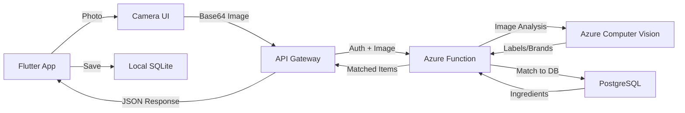

# Smart Scanner Implementation Plan

**Created**: November 3, 2025
**Purpose**: Enable users to photograph their bar inventory and automatically identify bottles/ingredients using Azure Computer Vision
**Target Platforms**: Android (Phase 1), iOS (Phase 2)
**Estimated Implementation Time**: 3-4 days

## Executive Summary

The Smart Scanner feature allows users to take photos of their bar setup, and the app will automatically identify bottles and ingredients using Azure Computer Vision, adding them to the user's "My Bar" inventory. This creates a seamless onboarding experience and helps users quickly catalog their available ingredients.

## Architecture Overview



## Cost Analysis

### Azure Computer Vision Pricing (Standard S1 Tier)
- **First 5,000 transactions/month**: $1 per 1,000 transactions
- **5,000-100,000 transactions/month**: $0.65 per 1,000 transactions
- **Estimated cost for 1,000 users (5 scans/month each)**: ~$5/month

### Entitlement Limits
- **Free (none)**: No access to Smart Scanner
- **Subscriber (paid, $9.99/month)**: 100 scans per month

## Implementation Steps

### Phase 1: Azure Computer Vision Setup

#### 1.1 Create Computer Vision Resource

```bash
# Create Computer Vision resource in South Central US
az cognitiveservices account create \
  --name cv-mba-prod \
  --resource-group rg-mba-prod \
  --kind ComputerVision \
  --sku F0 \
  --location southcentralus \
  --yes

# Get the endpoint and key
az cognitiveservices account show \
  --name cv-mba-prod \
  --resource-group rg-mba-prod \
  --query "properties.endpoint"

az cognitiveservices account keys list \
  --name cv-mba-prod \
  --resource-group rg-mba-prod \
  --query "key1"
```

#### 1.2 Add Secrets to Key Vault

```bash
# Store Computer Vision key in Key Vault
az keyvault secret set \
  --vault-name kv-mybartenderai-prod \
  --name AZURE-CV-KEY \
  --value "<computer-vision-key>"

# Store Computer Vision endpoint
az keyvault secret set \
  --vault-name kv-mybartenderai-prod \
  --name AZURE-CV-ENDPOINT \
  --value "https://cv-mba-prod.cognitiveservices.azure.com/"
```

#### 1.3 Update Function App Settings

```bash
# Add Key Vault references to Function App
az functionapp config appsettings set \
  --name func-mba-fresh \
  --resource-group rg-mba-prod \
  --settings \
    "AZURE_CV_KEY=@Microsoft.KeyVault(SecretUri=https://kv-mybartenderai-prod.vault.azure.net/secrets/AZURE-CV-KEY/)" \
    "AZURE_CV_ENDPOINT=@Microsoft.KeyVault(SecretUri=https://kv-mybartenderai-prod.vault.azure.net/secrets/AZURE-CV-ENDPOINT/)"
```

### Phase 2: Backend API Implementation

#### 2.1 Create New Azure Function Endpoint

**File**: `apps/backend/v3-deploy/vision-analyze/index.js`

```javascript
const axios = require('axios');

module.exports = async function (context, req) {
    context.log('Vision Analyze - Request received');

    // CORS headers
    const headers = {
        'Content-Type': 'application/json',
        'Access-Control-Allow-Origin': '*',
        'Access-Control-Allow-Methods': 'POST, OPTIONS',
        'Access-Control-Allow-Headers': 'Content-Type, x-functions-key',
    };

    // Handle OPTIONS
    if (req.method === 'OPTIONS') {
        context.res = { status: 200, headers, body: '' };
        return;
    }

    try {
        // Validate request
        const body = req.body || {};
        const { image, imageUrl } = body;

        if (!image && !imageUrl) {
            context.res = {
                status: 400,
                headers,
                body: { error: 'Either image (base64) or imageUrl is required' }
            };
            return;
        }

        // Get Computer Vision credentials
        const cvKey = process.env.AZURE_CV_KEY;
        const cvEndpoint = process.env.AZURE_CV_ENDPOINT;

        if (!cvKey || !cvEndpoint) {
            context.log.error('Computer Vision credentials not configured');
            context.res = {
                status: 500,
                headers,
                body: { error: 'Vision service not configured' }
            };
            return;
        }

        // Prepare image data
        let imageData;
        let contentType;

        if (imageUrl) {
            // URL-based image
            imageData = JSON.stringify({ url: imageUrl });
            contentType = 'application/json';
        } else {
            // Base64 image - convert to binary
            imageData = Buffer.from(image, 'base64');
            contentType = 'application/octet-stream';
        }

        // Call Computer Vision API
        const visionUrl = `${cvEndpoint}vision/v3.2/analyze?visualFeatures=Tags,Description,Objects,Brands&language=en`;

        context.log('Calling Computer Vision API...');
        const visionResponse = await axios.post(visionUrl, imageData, {
            headers: {
                'Ocp-Apim-Subscription-Key': cvKey,
                'Content-Type': contentType
            }
        });

        // Process results
        const analysis = visionResponse.data;
        context.log('Vision analysis complete:', {
            tags: analysis.tags?.length || 0,
            objects: analysis.objects?.length || 0,
            brands: analysis.brands?.length || 0
        });

        // Extract potential alcohol-related items
        const detectedItems = extractAlcoholItems(analysis);

        // Match to database ingredients
        const matchedIngredients = await matchToDatabase(context, detectedItems);

        // Return results
        context.res = {
            status: 200,
            headers,
            body: {
                success: true,
                detected: detectedItems,
                matched: matchedIngredients,
                confidence: calculateConfidence(analysis),
                rawAnalysis: {
                    description: analysis.description?.captions?.[0]?.text || '',
                    tags: analysis.tags?.slice(0, 10) || [],
                    brands: analysis.brands || []
                }
            }
        };

    } catch (error) {
        context.log.error('Vision analysis error:', error);
        context.res = {
            status: 500,
            headers,
            body: {
                error: 'Failed to analyze image',
                message: error.message
            }
        };
    }
};

// Helper function to extract alcohol-related items
function extractAlcoholItems(analysis) {
    const items = [];
    const alcoholKeywords = [
        'bottle', 'whiskey', 'vodka', 'rum', 'gin', 'tequila', 'wine',
        'beer', 'liquor', 'alcohol', 'spirit', 'bourbon', 'scotch',
        'brandy', 'cognac', 'champagne', 'prosecco', 'liqueur'
    ];

    // Check tags
    if (analysis.tags) {
        for (const tag of analysis.tags) {
            const name = tag.name.toLowerCase();
            if (alcoholKeywords.some(keyword => name.includes(keyword))) {
                items.push({
                    type: 'tag',
                    name: tag.name,
                    confidence: tag.confidence
                });
            }
        }
    }

    // Check brands (for alcohol brands)
    if (analysis.brands) {
        for (const brand of analysis.brands) {
            items.push({
                type: 'brand',
                name: brand.name,
                confidence: brand.confidence || 0.8
            });
        }
    }

    // Check objects for bottles
    if (analysis.objects) {
        for (const obj of analysis.objects) {
            if (obj.object.toLowerCase().includes('bottle')) {
                items.push({
                    type: 'object',
                    name: 'bottle',
                    confidence: obj.confidence,
                    rectangle: obj.rectangle
                });
            }
        }
    }

    return items;
}

// Helper function to match detected items to database
async function matchToDatabase(context, detectedItems) {
    // For MVP, use a simple matching table
    // In production, this would query PostgreSQL
    const knownBrands = {
        'absolut': 'Absolut Vodka',
        'jack daniels': 'Jack Daniels',
        'jack daniel\'s': 'Jack Daniels',
        'smirnoff': 'Smirnoff Vodka',
        'bacardi': 'Bacardi Rum',
        'captain morgan': 'Captain Morgan Rum',
        'grey goose': 'Grey Goose Vodka',
        'patron': 'Patron Tequila',
        'hennessy': 'Hennessy Cognac',
        'johnnie walker': 'Johnnie Walker Scotch',
        'jim beam': 'Jim Beam Bourbon',
        'maker\'s mark': 'Maker\'s Mark Bourbon',
        'tanqueray': 'Tanqueray Gin',
        'bombay': 'Bombay Sapphire Gin',
        'jose cuervo': 'Jose Cuervo Tequila',
        'crown royal': 'Crown Royal Whisky',
        'jameson': 'Jameson Irish Whiskey',
        'baileys': 'Baileys Irish Cream',
        'kahlua': 'Kahlua',
        'cointreau': 'Cointreau',
        'grand marnier': 'Grand Marnier',
        'amaretto': 'Amaretto',
        'southern comfort': 'Southern Comfort'
    };

    const matched = [];

    for (const item of detectedItems) {
        if (item.type === 'brand' || item.type === 'tag') {
            const itemLower = item.name.toLowerCase();

            // Direct brand match
            for (const [key, value] of Object.entries(knownBrands)) {
                if (itemLower.includes(key) || key.includes(itemLower)) {
                    matched.push({
                        ingredientName: value,
                        confidence: item.confidence,
                        matchType: 'brand'
                    });
                    break;
                }
            }
        }
    }

    // Remove duplicates
    const unique = matched.filter((item, index, self) =>
        index === self.findIndex((t) => t.ingredientName === item.ingredientName)
    );

    return unique;
}

// Helper function to calculate overall confidence
function calculateConfidence(analysis) {
    let totalConfidence = 0;
    let count = 0;

    if (analysis.tags) {
        for (const tag of analysis.tags.slice(0, 5)) {
            totalConfidence += tag.confidence;
            count++;
        }
    }

    return count > 0 ? totalConfidence / count : 0;
}
```

**File**: `apps/backend/v3-deploy/vision-analyze/function.json`

```json
{
    "bindings": [
        {
            "authLevel": "function",
            "type": "httpTrigger",
            "direction": "in",
            "name": "req",
            "methods": ["post", "options"],
            "route": "v1/vision/analyze"
        },
        {
            "type": "http",
            "direction": "out",
            "name": "res"
        }
    ]
}
```

#### 2.2 Install Required Dependencies

```bash
cd apps/backend/v3-deploy
npm install axios
```

### Phase 3: Flutter Mobile Integration

#### 3.1 Add Camera Dependencies

**File**: `mobile/app/pubspec.yaml`

Add these dependencies:

```yaml
dependencies:
  # ... existing dependencies ...

  # Camera and image handling
  image_picker: ^1.0.8
  image: ^4.2.0
  http: ^1.2.2  # For multipart uploads if needed
```

Run:
```bash
cd mobile/app
flutter pub get
```

#### 3.2 Update Android Permissions

**File**: `mobile/app/android/app/src/main/AndroidManifest.xml`

Add permissions inside the `<manifest>` tag:

```xml
<uses-permission android:name="android.permission.CAMERA" />
<uses-permission android:name="android.permission.READ_EXTERNAL_STORAGE" />
```

#### 3.3 Update iOS Permissions

**File**: `mobile/app/ios/Runner/Info.plist`

Add these keys:

```xml
<key>NSCameraUsageDescription</key>
<string>MyBartenderAI needs camera access to scan your bar inventory</string>
<key>NSPhotoLibraryUsageDescription</key>
<string>MyBartenderAI needs photo library access to select photos of your bar</string>
```

#### 3.4 Create Vision API Service

**File**: `mobile/app/lib/src/api/vision_api.dart`

```dart
import 'dart:convert';
import 'dart:typed_data';
import 'package:dio/dio.dart';

class VisionApi {
  final Dio _dio;

  VisionApi(this._dio);

  Future<VisionAnalysisResponse> analyzeImage(Uint8List imageBytes) async {
    try {
      // Convert image to base64
      final base64Image = base64Encode(imageBytes);

      final response = await _dio.post<Map<String, dynamic>>(
        '/v1/vision/analyze',
        data: {
          'image': base64Image,
        },
        options: Options(
          headers: {
            'Content-Type': 'application/json',
          },
        ),
      );

      return VisionAnalysisResponse.fromJson(response.data!);
    } catch (e) {
      throw Exception('Failed to analyze image: $e');
    }
  }
}

class VisionAnalysisResponse {
  final bool success;
  final List<DetectedItem> detected;
  final List<MatchedIngredient> matched;
  final double confidence;
  final RawAnalysis rawAnalysis;

  VisionAnalysisResponse({
    required this.success,
    required this.detected,
    required this.matched,
    required this.confidence,
    required this.rawAnalysis,
  });

  factory VisionAnalysisResponse.fromJson(Map<String, dynamic> json) {
    return VisionAnalysisResponse(
      success: json['success'] ?? false,
      detected: (json['detected'] as List?)
          ?.map((item) => DetectedItem.fromJson(item))
          .toList() ?? [],
      matched: (json['matched'] as List?)
          ?.map((item) => MatchedIngredient.fromJson(item))
          .toList() ?? [],
      confidence: (json['confidence'] ?? 0).toDouble(),
      rawAnalysis: RawAnalysis.fromJson(json['rawAnalysis'] ?? {}),
    );
  }
}

class DetectedItem {
  final String type;
  final String name;
  final double confidence;

  DetectedItem({
    required this.type,
    required this.name,
    required this.confidence,
  });

  factory DetectedItem.fromJson(Map<String, dynamic> json) {
    return DetectedItem(
      type: json['type'] ?? '',
      name: json['name'] ?? '',
      confidence: (json['confidence'] ?? 0).toDouble(),
    );
  }
}

class MatchedIngredient {
  final String ingredientName;
  final double confidence;
  final String matchType;

  MatchedIngredient({
    required this.ingredientName,
    required this.confidence,
    required this.matchType,
  });

  factory MatchedIngredient.fromJson(Map<String, dynamic> json) {
    return MatchedIngredient(
      ingredientName: json['ingredientName'] ?? '',
      confidence: (json['confidence'] ?? 0).toDouble(),
      matchType: json['matchType'] ?? '',
    );
  }
}

class RawAnalysis {
  final String description;
  final List<dynamic> tags;
  final List<dynamic> brands;

  RawAnalysis({
    required this.description,
    required this.tags,
    required this.brands,
  });

  factory RawAnalysis.fromJson(Map<String, dynamic> json) {
    return RawAnalysis(
      description: json['description'] ?? '',
      tags: json['tags'] ?? [],
      brands: json['brands'] ?? [],
    );
  }
}
```

#### 3.5 Create Smart Scanner Screen

**File**: `mobile/app/lib/src/features/smart_scanner/smart_scanner_screen.dart`

```dart
import 'package:flutter/material.dart';
import 'package:flutter_riverpod/flutter_riverpod.dart';
import 'package:image_picker/image_picker.dart';
import 'dart:typed_data';
import 'dart:io';
import '../../api/vision_api.dart';
import '../../providers/inventory_provider.dart';
import '../../theme/app_colors.dart';
import '../../theme/app_spacing.dart';
import '../../theme/app_typography.dart';

class SmartScannerScreen extends ConsumerStatefulWidget {
  const SmartScannerScreen({super.key});

  @override
  ConsumerState<SmartScannerScreen> createState() => _SmartScannerScreenState();
}

class _SmartScannerScreenState extends ConsumerState<SmartScannerScreen> {
  final ImagePicker _picker = ImagePicker();
  bool _isProcessing = false;
  Uint8List? _imageBytes;
  VisionAnalysisResponse? _analysisResult;
  final Set<String> _selectedIngredients = {};

  Future<void> _pickImage(ImageSource source) async {
    try {
      final XFile? image = await _picker.pickImage(
        source: source,
        maxWidth: 1024,  // Limit image size for faster processing
        maxHeight: 1024,
        imageQuality: 85,
      );

      if (image != null) {
        final bytes = await image.readAsBytes();
        setState(() {
          _imageBytes = bytes;
          _analysisResult = null;
          _selectedIngredients.clear();
        });

        await _analyzeImage(bytes);
      }
    } catch (e) {
      _showError('Failed to pick image: $e');
    }
  }

  Future<void> _analyzeImage(Uint8List bytes) async {
    setState(() {
      _isProcessing = true;
    });

    try {
      // Get vision API instance
      final visionApi = ref.read(visionApiProvider);

      // Analyze image
      final result = await visionApi.analyzeImage(bytes);

      setState(() {
        _analysisResult = result;
        // Auto-select high confidence matches
        for (final match in result.matched) {
          if (match.confidence > 0.7) {
            _selectedIngredients.add(match.ingredientName);
          }
        }
      });
    } catch (e) {
      _showError('Failed to analyze image: $e');
    } finally {
      setState(() {
        _isProcessing = false;
      });
    }
  }

  Future<void> _addToInventory() async {
    if (_selectedIngredients.isEmpty) {
      _showError('Please select at least one ingredient');
      return;
    }

    try {
      // Add each selected ingredient to inventory
      for (final ingredient in _selectedIngredients) {
        await ref.read(inventoryProvider.notifier).addIngredient(
          ingredient,
          'Added via Smart Scanner',
        );
      }

      // Show success message
      if (mounted) {
        ScaffoldMessenger.of(context).showSnackBar(
          SnackBar(
            content: Text('Added ${_selectedIngredients.length} items to your bar'),
            backgroundColor: AppColors.success,
          ),
        );

        // Navigate back
        Navigator.of(context).pop();
      }
    } catch (e) {
      _showError('Failed to add ingredients: $e');
    }
  }

  void _showError(String message) {
    if (mounted) {
      ScaffoldMessenger.of(context).showSnackBar(
        SnackBar(
          content: Text(message),
          backgroundColor: AppColors.error,
        ),
      );
    }
  }

  @override
  Widget build(BuildContext context) {
    return Scaffold(
      backgroundColor: AppColors.backgroundDark,
      appBar: AppBar(
        title: Text('Smart Scanner', style: AppTypography.headingMedium),
        backgroundColor: AppColors.backgroundSecondary,
      ),
      body: SingleChildScrollView(
        padding: EdgeInsets.all(AppSpacing.md),
        child: Column(
          crossAxisAlignment: CrossAxisAlignment.stretch,
          children: [
            // Instructions
            Container(
              padding: EdgeInsets.all(AppSpacing.md),
              decoration: BoxDecoration(
                color: AppColors.backgroundSecondary,
                borderRadius: BorderRadius.circular(16),
                border: Border.all(color: AppColors.border),
              ),
              child: Column(
                children: [
                  Icon(Icons.camera_alt, color: AppColors.primary, size: 48),
                  SizedBox(height: AppSpacing.sm),
                  Text(
                    'Scan Your Bar',
                    style: AppTypography.headingSmall,
                  ),
                  SizedBox(height: AppSpacing.xs),
                  Text(
                    'Take a photo of your bottles and we\'ll identify them for you',
                    style: AppTypography.bodyMedium.copyWith(
                      color: AppColors.textSecondary,
                    ),
                    textAlign: TextAlign.center,
                  ),
                ],
              ),
            ),

            SizedBox(height: AppSpacing.lg),

            // Camera/Gallery buttons
            Row(
              children: [
                Expanded(
                  child: ElevatedButton.icon(
                    onPressed: _isProcessing ? null : () => _pickImage(ImageSource.camera),
                    icon: Icon(Icons.camera_alt),
                    label: Text('Take Photo'),
                    style: ElevatedButton.styleFrom(
                      backgroundColor: AppColors.primary,
                      padding: EdgeInsets.all(AppSpacing.md),
                    ),
                  ),
                ),
                SizedBox(width: AppSpacing.md),
                Expanded(
                  child: ElevatedButton.icon(
                    onPressed: _isProcessing ? null : () => _pickImage(ImageSource.gallery),
                    icon: Icon(Icons.photo_library),
                    label: Text('Choose Photo'),
                    style: ElevatedButton.styleFrom(
                      backgroundColor: AppColors.secondary,
                      padding: EdgeInsets.all(AppSpacing.md),
                    ),
                  ),
                ),
              ],
            ),

            // Image preview
            if (_imageBytes != null) ...[
              SizedBox(height: AppSpacing.lg),
              Container(
                height: 200,
                decoration: BoxDecoration(
                  borderRadius: BorderRadius.circular(16),
                  border: Border.all(color: AppColors.border),
                ),
                child: ClipRRect(
                  borderRadius: BorderRadius.circular(16),
                  child: Image.memory(
                    _imageBytes!,
                    fit: BoxFit.cover,
                  ),
                ),
              ),
            ],

            // Processing indicator
            if (_isProcessing) ...[
              SizedBox(height: AppSpacing.lg),
              Center(
                child: Column(
                  children: [
                    CircularProgressIndicator(color: AppColors.primary),
                    SizedBox(height: AppSpacing.md),
                    Text(
                      'Analyzing image...',
                      style: AppTypography.bodyMedium,
                    ),
                  ],
                ),
              ),
            ],

            // Results
            if (_analysisResult != null && !_isProcessing) ...[
              SizedBox(height: AppSpacing.lg),

              // Confidence indicator
              Container(
                padding: EdgeInsets.all(AppSpacing.sm),
                decoration: BoxDecoration(
                  color: AppColors.backgroundSecondary,
                  borderRadius: BorderRadius.circular(8),
                ),
                child: Row(
                  mainAxisAlignment: MainAxisAlignment.center,
                  children: [
                    Icon(
                      Icons.analytics,
                      color: _analysisResult!.confidence > 0.7
                          ? AppColors.success
                          : AppColors.warning,
                      size: 20,
                    ),
                    SizedBox(width: AppSpacing.xs),
                    Text(
                      'Confidence: ${(_analysisResult!.confidence * 100).toStringAsFixed(0)}%',
                      style: AppTypography.bodyMedium,
                    ),
                  ],
                ),
              ),

              SizedBox(height: AppSpacing.md),

              // Matched ingredients
              if (_analysisResult!.matched.isNotEmpty) ...[
                Text(
                  'Detected Bottles',
                  style: AppTypography.headingSmall,
                ),
                SizedBox(height: AppSpacing.sm),

                ...(_analysisResult!.matched.map((match) =>
                  CheckboxListTile(
                    title: Text(
                      match.ingredientName,
                      style: AppTypography.bodyMedium,
                    ),
                    subtitle: Text(
                      'Confidence: ${(match.confidence * 100).toStringAsFixed(0)}%',
                      style: AppTypography.bodySmall.copyWith(
                        color: AppColors.textSecondary,
                      ),
                    ),
                    value: _selectedIngredients.contains(match.ingredientName),
                    onChanged: (bool? value) {
                      setState(() {
                        if (value ?? false) {
                          _selectedIngredients.add(match.ingredientName);
                        } else {
                          _selectedIngredients.remove(match.ingredientName);
                        }
                      });
                    },
                    activeColor: AppColors.primary,
                    checkColor: Colors.white,
                  ),
                )),

                SizedBox(height: AppSpacing.lg),

                // Add to inventory button
                ElevatedButton(
                  onPressed: _selectedIngredients.isEmpty
                      ? null
                      : _addToInventory,
                  child: Text('Add ${_selectedIngredients.length} Items to My Bar'),
                  style: ElevatedButton.styleFrom(
                    backgroundColor: AppColors.success,
                    padding: EdgeInsets.all(AppSpacing.md),
                    minimumSize: Size(double.infinity, 48),
                  ),
                ),
              ] else ...[
                // No matches found
                Container(
                  padding: EdgeInsets.all(AppSpacing.lg),
                  decoration: BoxDecoration(
                    color: AppColors.backgroundSecondary,
                    borderRadius: BorderRadius.circular(16),
                    border: Border.all(color: AppColors.warning),
                  ),
                  child: Column(
                    children: [
                      Icon(
                        Icons.search_off,
                        color: AppColors.warning,
                        size: 48,
                      ),
                      SizedBox(height: AppSpacing.sm),
                      Text(
                        'No bottles detected',
                        style: AppTypography.headingSmall,
                      ),
                      SizedBox(height: AppSpacing.xs),
                      Text(
                        'Try taking a clearer photo with better lighting',
                        style: AppTypography.bodyMedium.copyWith(
                          color: AppColors.textSecondary,
                        ),
                        textAlign: TextAlign.center,
                      ),
                    ],
                  ),
                ),
              ],

              // Raw analysis (debug info - remove in production)
              if (_analysisResult!.rawAnalysis.description.isNotEmpty) ...[
                SizedBox(height: AppSpacing.md),
                Container(
                  padding: EdgeInsets.all(AppSpacing.sm),
                  decoration: BoxDecoration(
                    color: AppColors.backgroundSecondary.withOpacity(0.5),
                    borderRadius: BorderRadius.circular(8),
                  ),
                  child: Column(
                    crossAxisAlignment: CrossAxisAlignment.start,
                    children: [
                      Text(
                        'AI Description:',
                        style: AppTypography.bodySmall.copyWith(
                          fontWeight: FontWeight.bold,
                        ),
                      ),
                      Text(
                        _analysisResult!.rawAnalysis.description,
                        style: AppTypography.bodySmall.copyWith(
                          color: AppColors.textSecondary,
                        ),
                      ),
                    ],
                  ),
                ),
              ],
            ],
          ],
        ),
      ),
    );
  }
}
```

#### 3.6 Create Vision API Provider

**File**: `mobile/app/lib/src/providers/vision_provider.dart`

```dart
import 'package:flutter_riverpod/flutter_riverpod.dart';
import 'package:dio/dio.dart';
import '../api/vision_api.dart';
import '../app/bootstrap.dart';
import '../config/app_config.dart';

final visionApiProvider = Provider<VisionApi>((ref) {
  final config = ref.watch(envConfigProvider);
  final dio = createBaseDio(config);
  return VisionApi(dio);
});
```

#### 3.7 Update Routes

**File**: `mobile/app/lib/src/app/router.dart`

Add the Smart Scanner route:

```dart
GoRoute(
  path: '/smart-scanner',
  name: 'smart-scanner',
  builder: (context, state) => const SmartScannerScreen(),
),
```

#### 3.8 Update Home Screen Navigation

**File**: `mobile/app/lib/src/features/home/home_screen.dart`

Update the Smart Scanner card onTap:

```dart
FeatureCard(
  icon: Icons.camera_alt,
  title: 'Smart Scanner',
  subtitle: 'Inventory with camera',
  color: AppColors.purple,
  onTap: () => context.pushNamed('smart-scanner'),
),
```

### Phase 4: Testing Strategy

#### 4.1 Manual Testing Checklist

- [ ] Camera permission request on first use
- [ ] Photo capture from camera
- [ ] Photo selection from gallery
- [ ] Image upload and processing indicator
- [ ] Results display with confidence scores
- [ ] Ingredient selection/deselection
- [ ] Add to inventory functionality
- [ ] Error handling for network failures
- [ ] Error handling for low confidence results

#### 4.2 Test Images

Prepare test images with:
1. Single bottle (clear label)
2. Multiple bottles
3. Bottles with poor lighting
4. Non-alcohol items (negative test)
5. Mixed bar setup with bottles and mixers

#### 4.3 Backend Testing

```bash
# Test the vision endpoint locally
curl -X POST https://func-mba-fresh.azurewebsites.net/api/v1/vision/analyze \
  -H "Content-Type: application/json" \
  -H "x-functions-key: YOUR_FUNCTION_KEY" \
  -d '{
    "imageUrl": "https://example.com/test-bottle.jpg"
  }'
```

### Phase 5: Deployment

1. Deploy backend function:
```bash
cd apps/backend/v3-deploy
func azure functionapp publish func-mba-fresh --javascript
```

2. Test on Android emulator:
```bash
cd mobile/app
flutter run
```

3. Build APK for testing:
```bash
flutter build apk --release
```

## Success Criteria

1. **Accuracy**: 70%+ accuracy in identifying common spirit brands
2. **Performance**: Image analysis completes in < 5 seconds
3. **UX**: Clear feedback during processing and results display
4. **Error Handling**: Graceful handling of failures with retry options
5. **Integration**: Successfully adds identified items to inventory

## Known Limitations

1. **Brand Recognition**: Limited to major brands initially
2. **Label Visibility**: Requires clear view of bottle labels
3. **Lighting**: Performance degrades in poor lighting
4. **Multiple Items**: May struggle with many bottles in one image

## Future Enhancements

1. **Custom Vision Model**: Train custom model for better accuracy
2. **Barcode Scanning**: Add barcode/QR code scanning
3. **OCR**: Extract text from labels for better matching
4. **Batch Processing**: Handle multiple photos in sequence
5. **Learning**: Improve accuracy based on user corrections

## Troubleshooting Guide

### Common Issues and Solutions

1. **Camera not working**
   - Check permissions in device settings
   - Restart the app
   - Check AndroidManifest.xml/Info.plist

2. **Analysis fails**
   - Check internet connection
   - Verify Azure credentials
   - Check image size (max 4MB)

3. **Poor recognition**
   - Better lighting needed
   - Clear view of labels
   - One bottle at a time initially

4. **Ingredients not saving**
   - Check local database
   - Verify inventory provider
   - Check for duplicate entries

## References

- [Azure Computer Vision Documentation](https://docs.microsoft.com/en-us/azure/cognitive-services/computer-vision/)
- [Flutter Image Picker](https://pub.dev/packages/image_picker)
- [Azure Computer Vision API Reference](https://westus.dev.cognitive.microsoft.com/docs/services/computer-vision-v3-2/operations/56f91f2e778daf14a499f21b)