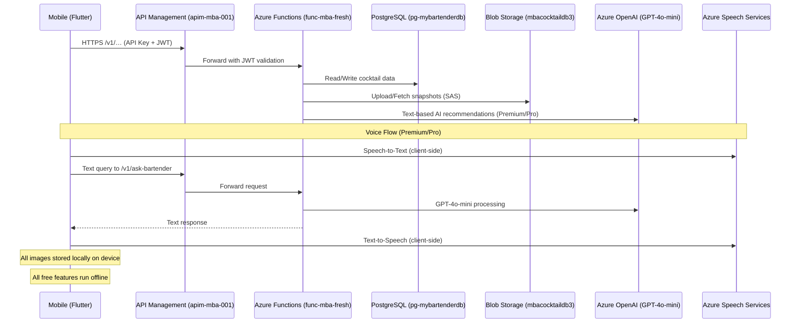
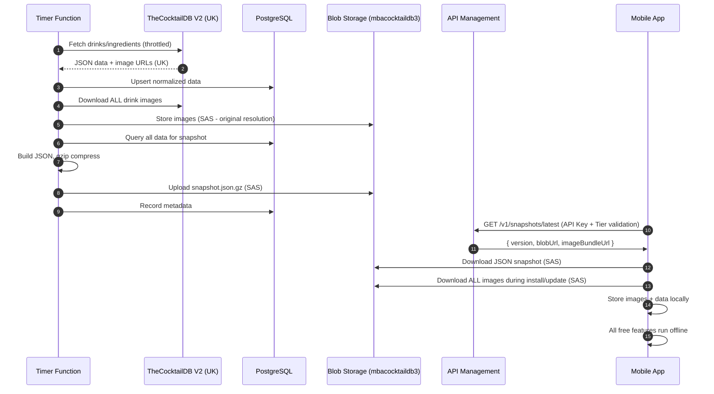

# Architecture — MyBartenderAI (MVP)

## System Overview

- Flutter app (feature-first clean architecture; Riverpod state; GoRouter)
- **Azure API Management** (`apim-mba-001`) as API gateway for tier management
- Azure Functions (HTTP) behind APIM for backend logic
- Azure PostgreSQL (`pg-mybartenderdb`) for authoritative recipe corpus with AI enhancements
- Azure Blob Storage (`mbacocktaildb3`) for cocktail images (US-hosted) and JSON snapshots
- Key Vault (`kv-mybartenderai-prod`) for secrets; App Insights for telemetry
- All free features run locally on device (offline-first)
- Mobile → APIM → Azure Functions (HTTPS) → (PostgreSQL/Blob/Key Vault/Azure OpenAI)

## Core Features

### Current (MVP)

- AI-powered cocktail recommendations based on inventory (**GPT-4o-mini**)
- Offline-first mobile experience with local SQLite
- JWT-based authentication and APIM-based rate limiting per tier

### Planned (Premium/Pro)

- **Vision AI**: Photograph home bar for automatic inventory (Azure Computer Vision)
- **Voice Assistant**: Interactive cocktail-making guidance (Azure Speech Services)
- **Custom Recipes**: User-created cocktails with AI enhancement

## Data Flow (Mermaid)



## AI Model & Cost Strategy

- **Recommendations**: **GPT-4o-mini** (cost/latency optimized)
  - Input: $0.15 per 1M tokens
  - Output: $0.60 per 1M tokens
  - ~$0.007 per cocktail conversation
- **Voice**: **Azure Speech Services** (93% cheaper than OpenAI Realtime API)
  - Speech-to-Text: $1 per audio hour (~$0.017/minute)
  - Neural Text-to-Speech: $16 per 1M characters (~$0.00005 per response)
  - Total voice session cost: ~$0.10 per 5-minute interaction
- **Vision**: Azure Computer Vision (70% confidence threshold) - Future
- **Prompt Optimization**: Structured prompts for GPT-4o-mini efficiency

## Tier Quotas (Monthly)

| Feature            | Free      | Premium   | Pro       |
| ------------------ | --------- | --------- | --------- |
| AI Recommendations | 10        | 100       | Unlimited |
| Vision Scans       | 0         | 5         | 50        |
| Voice Assistant    | 0         | 30 min    | 5 hours   |
| Custom Recipes     | 3         | 25        | Unlimited |
| Snapshot Downloads | Unlimited | Unlimited | Unlimited |

## API Management (APIM) Configuration

### Instance Details

- **Name**: `apim-mba-001`
- **Resource Group**: `rg-mba-prod`
- **Location**: South Central US
- **Gateway URL**: https://apim-mba-001.azure-api.net
- **Developer Portal**: https://apim-mba-001.developer.azure-api.net
- **Current Tier**: Developer (No SLA) - ~$50/month for development
- **Production Plan**: Consumption tier (~$5-15/month based on usage)

### Products (Subscription Tiers)

**Free Tier Product:**

- Rate limit: 100 calls/day
- Features: Local cocktail database, basic search
- No AI features (blocked at APIM)

**Premium Tier Product ($4.99/month):**

- Rate limit: 1,000 calls/day
- Features: AI recommendations (100/month), Voice (30 min/month), Vision (5 scans/month)
- Priority routing

**Pro Tier Product ($9.99/month):**

- Rate limit: Unlimited
- Features: Unlimited AI, Voice (5 hours/month), Vision (50 scans/month)
- Highest priority, dedicated support

### Backend Integration

- APIM forwards requests to Function App: `func-mba-fresh.azurewebsites.net`
- JWT validation at APIM layer
- Rate limiting policies per product
- Caching for read-heavy endpoints (`/v1/snapshots/latest`)

## Feature: CocktailDB Mirror & JSON Snapshot Service

**Goal:** Nightly sync from TheCocktailDB V2 API into PostgreSQL, download all images to Azure Blob Storage (US), build compressed JSON snapshots for mobile offline use.

### Architecture (Current MVP State)

- **Storage Access**: SAS tokens (due to Windows Consumption Plan Managed Identity limitations)
- **Compression**: gzip (built-in, no dependencies)
- **Images**: Downloaded from TheCocktailDB (UK) to Azure Blob Storage (`mbacocktaildb3`, US), then bundled for mobile app
- **Distribution**: Via APIM endpoints with tier-based rate limiting

### Components

- **Timer Function** `sync-cocktaildb` (nightly @ 03:30 UTC)
- **HTTP Function** `GET /v1/snapshots/latest` → metadata with SAS-secured access
- **HTTP Function** `GET /v1/images/manifest` → image bundle manifest for mobile sync
- **PostgreSQL** (`pg-mybartenderdb`): Authoritative data with AI enhancements
- **Blob Storage** (`mbacocktaildb3`): 
  - `/snapshots/json/{schemaVersion}/{snapshotVersion}.json.gz`
  - `/drink-images/drinks/{filename}.jpg` (original resolution from TheCocktailDB)
- **Mobile**: Downloads JSON + all images during installation, stores locally for offline use

### Data Pipeline



### Snapshot Retention

- Keep last 7 daily snapshots (1 week rollback)
- Metadata tracks version, size, drink count
- Mobile app caches and checks for updates

## Voice Interaction Architecture (Premium/Pro)

### Why Azure Speech Services vs OpenAI Realtime API

**Cost Comparison (5-minute cocktail session):**

- OpenAI Realtime API: ~$1.50/session
- Azure Speech + GPT-4o-mini: ~$0.10/session
- **93% cost savings**

### Implementation Flow

```
1. User speaks → Azure Speech SDK (client-side)
2. Speech-to-Text → Text transcription
3. Text → APIM → Function App → GPT-4o-mini
4. Response text → Azure Text-to-Speech SDK (client-side)
5. Audio playback to user
```

### Azure Speech Services Features

- **Speech-to-Text**: Real-time recognition with custom vocabulary (bartending terms)
- **Neural Text-to-Speech**: Natural voice with SSML control
- **Custom Models**: Train on cocktail-specific terminology (muddler, jigger, Aperol, etc.)
- **Offline Capability**: Download voices for offline TTS

### Voice Assistant Functions

- `ask-bartender`: Main conversational endpoint (uses GPT-4o-mini)
- `ask-bartender-simple`: Simplified for testing
- `ask-bartender-test`: Non-auth testing endpoint

## Security & Privacy

### Authentication & Access

- JWT authentication via Microsoft Entra External ID
- APIM API keys (subscription keys) per mobile app installation
- SAS tokens for blob access (MVP - temporary)
- Future: Managed Identity for all service-to-service access
- Function keys for admin endpoints

### PII Policy

- **Custom recipe names**: Stripped from telemetry
- **Voice transcripts**: Opt-in storage only (default: ephemeral processing)
- **Bar photos**: Processed ephemerally, never stored
- **User ingredients**: Hashed before logging
- **Anonymization**: 90-day retention for opted-in data

### Secrets Management

- **Key Vault**: `kv-mybartenderai-prod` (in `rg-mba-dev` resource group)
  - Secret `COCKTAILDB-API-KEY`: TheCocktailDB V2 API key
  - Secret `OpenAI`: Azure OpenAI API key (GPT-4o-mini)
  - Secret `POSTGRES-CONNECTION-STRING`: PostgreSQL connection string (`pg-mybartenderdb`)
  - Temporary: SAS tokens for blob access
- **Function App**: `func-mba-fresh` uses connection strings to Key Vault (MVP)
- **Future**: Managed Identity with Key Vault Secrets User role
- **App Settings**: Use `@Microsoft.KeyVault(VaultName=kv-mybartenderai-prod;SecretName=...)`

## Azure Resources Summary

### Resource Group: `rg-mba-prod` (South Central US)

- **API Management**: `apim-mba-001`
- **Function App**: `func-mba-fresh` (Windows Consumption Plan)
  - URL: https://func-mba-fresh.azurewebsites.net
- **Storage Account**: `mbacocktaildb3`
- **PostgreSQL**: `pg-mybartenderdb`
- **Speech Services**: TBD (to be created)

### Resource Group: `rg-mba-dev`

- **Key Vault**: `kv-mybartenderai-prod`

## Mobile App Updates

### JSON Import Strategy

1. Download compressed JSON snapshot via APIM
2. Decompress in memory
3. Parse JSON structure
4. Import to local SQLite using transactions
5. Atomic database swap

### Image Storage Strategy

- **Initial Install**: Download ALL drink images (~621 images) from Azure Blob to device
- **Updates**: Download only new/changed images (delta sync via manifest)
- **Source**: TheCocktailDB images re-hosted in Azure Blob Storage (`mbacocktaildb3`, US region)
- **Local Storage**: All images stored on device for instant offline access
- **No Network**: Free features (browse, search, view recipes) work 100% offline
- **Premium Features Only**: AI recommendations, vision, voice require network + APIM validation

## Future Enhancements

### Phase 2: Premium Features

- Vision AI integration for inventory scanning (Azure Computer Vision)
- Voice-guided cocktail making (Azure Speech Services)
- Custom recipe creation with AI assistance (GPT-4o-mini)

### Phase 3: Advanced

- Real-time collaboration on recipes
- Social features (share custom cocktails)
- Ingredient substitution AI
- Cocktail history and preferences learning
- Multi-language support (Azure Speech Translation)

### Phase 4: Platform Optimization

- Migrate to Managed Identity (all services)
- APIM Consumption tier for production
- Azure Front Door for global CDN (if needed)
- Premium/Dedicated PostgreSQL tier for scale

## Development & Deployment

### Local Development

```bash
# Backend
cd apps/backend
npm install  # Windows-compatible, no native modules
npm run build
func start

# Mobile
cd mobile/app
flutter pub get
flutter run

# APIM local testing
# Use APIM test console or Postman with API keys
```

### Deployment

- **Azure Functions**: ZIP deployment to Windows Consumption plan (`func-mba-fresh`)
- **SDK**: Azure Functions v4 programming model
- **Runtime**: Node.js 20 on Windows
- **No native dependencies**: Pure JavaScript/TypeScript (no better-sqlite3)
- **CI/CD**: GitHub Actions workflow (`.github/workflows/main_func-mba-fresh.yml`)
- **Secrets**: All environment variables via Key Vault references
- **Access**: Connection strings + SAS tokens (MVP), Managed Identity (future)
- **APIM**: Manual configuration via Azure Portal (Developer tier)

## Cost Optimization

### Current MVP Cost (~$60-70/month)

- **APIM Developer**: ~$50/month (fixed cost for development)
- **Functions**: Windows Consumption plan (~$0.20/million executions, minimal for MVP)
- **Storage**: ~$0.50-1/month (snapshots + ~621 images)
- **PostgreSQL**: Basic tier ~$12-30/month (`pg-mybartenderdb`)
- **Azure OpenAI (GPT-4o-mini)**: Pay-per-use, ~$0.40/user/month for Premium
- **Azure Speech Services**: Free tier: 5 hours/month, then $1/hour

### Production Target (~$20-30/month base + usage)

- **APIM Consumption**: ~$5-15/month (based on actual usage)
- **Functions**: Same (~$0.20/million executions)
- **Storage**: ~$0.50-1/month
- **PostgreSQL**: Optimized tier ~$12-20/month
- **AI Services**: Covered by Premium/Pro subscription revenue
- **Speech Services**: ~$10-20/month for moderate usage

### Revenue Model

- **Premium ($4.99/month)**: Covers AI + Speech costs ($0.40-0.50/user/month)
- **Pro ($9.99/month)**: Higher limits, improved margins
- **Target**: 1,000 Premium users = $5,000 revenue, ~$500 AI costs = **90% margin**

## Success Metrics

- **API Integration**: All endpoints working with <500ms latency
- **Offline Mode**: Full functionality without network for Free tier
- **Voice**: <2 seconds end-to-end latency for voice interactions
- **Auth**: Seamless login/logout with token refresh
- **Cost**: Stay within $2-5/month per Premium user for AI services
- **User Experience**: 4.5+ star rating target on app stores
